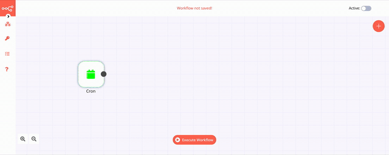
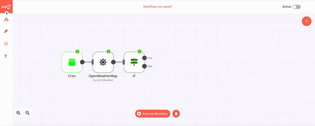
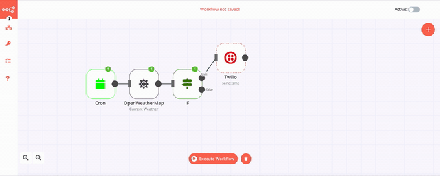

# Creating Your First Workflow

Let's create your first workflow in n8n. We'll create a workflow which will run every morning at 8 AM and will send an SMS if you should take a sweater with you. You can also find the [workflow](https://n8n.io/workflows/409) on the website.

This workflow would use the following nodes.
- [Cron](../nodes/nodes-library/core-nodes/Cron/README.md) - Specify when the workflow should start (be triggered)
- [OpenWeatherMap](../nodes/nodes-library/nodes/OpenWeatherMap/README.md) - Get weather details for a particular city
- [IF](../nodes/nodes-library/core-nodes/IF/README.md) - Conditional logic to decide the flow of the workflow
- [Twilio](../nodes/nodes-library/nodes/Twilio/README.md) - Send an SMS
- [NoOp](../nodes/nodes-library/core-nodes/NoOp/README.md) - Do nothing (optional)

The final workflow should look like the following image.


## 1. Cron node

We'll use the Cron trigger node for starting the workflow. Add a Cron node by clicking on the + button on the top right of the *Editor UI*. Click on the *Cron* node under the section marked *Trigger*.

Double click on the Cron node to enter the *Node Editor*. Click on the *Add Cron Time* button under the section marked *Trigger Times*. Since we want the workflow to run every day at 8 AM, we'll let the *Mode* be 'Every Day' and set *Hour* to 8.

Here's a GIF of me following the steps mentioned above.


## 2. OpenWeatherMap node

Add the OpenWeatherMap node by clicking on the + button and selecting the *OpenWeatherMap* node. Double click on the node and create credentials for the node by clicking on the *Select Credentials* dropdown list and selecting *Create New*. 

You'll need to enter an *Access Token* for the OpenWeatherMap API. You can find instructions on how to obtain that [here](../nodes/credentials/OpenWeatherMap/README.md).

We'll let the other options stay as they are. I'll enter the city name to `berlin,de` here, feel free to enter another city's name. Click on the *Execute Node* button on the top right to get the data from the API. You can then see the data from the API in JSON or Table format.

Here's a GIF of me following the steps mentioned above.




## 3. IF node

Add the IF node by clicking on the + button and selecting the *IF* node. This is a conditional logic node that allows us to alter the flow of the workflow depending on the data that we get from the previous node(s).

Double click on the node, click on the *Add Condition* button, and select *Number* from the menu. Since the *Value 1* (temperature) would be a dynamic piece of information, click on the gears icon next to the field, and select *Add Expressions*.

This will open up the *Variable Selector*. From the left panel, select the following variable:

`Nodes > Output Data > JSON > main > feels_like`

For the *Operation* field, we'll let it be set to 'Smaller'. For the *Value 2*, I entered 18. This will ensure that the IF node returns true only if the weather is lower than 18°C. Feel free to change this to some other value. 

Here's a GIF of me following the steps mentioned above.


## 4. Twilio node

Add the Twilio node by clicking on the + button and selecting the *Twilio* node. Connect this node with the *true* output of the IF node.

Double click on the node and create credentials for the node by clicking on the *Select Credentials* dropdown list and selecting *Create New*. 

You'll need to enter an *Account SID* and *Auth Token* for the Twilio API. You can find instructions on how to obtain that [here](../nodes/credentials/Twilio/README.md). Now, enter the phone number from which you'll be sending the message in the *From* field (you'll have to create a Trial Number for yourself in the Twilio [console](https://www.twilio.com/console)). Enter the phone number to which you'll be sending the message in the *To* field (this will have to be the phone number you verified your Twilio account with, if you are using a trial account).

You can now add the message that you want to send yourself if the temperature is lower than 18°C. This is what I added in the *Message* field (you can click on *Add Expressions* and paste this):

```
Wear a sweater today, it is {{$node["OpenWeatherMap"].json["main"]["feels_like"]}}°C outside right now.
```

Here's a GIF of me following the steps mentioned above.




## 5. NoOp node

If the temperature is greater than 18°C, we don't want the workflow to do anything. We'll use the NoOp node for that. Adding this node here is optional, as the absence of this node won't make a difference to the functioning of the workflow. Add the NoOp node by clicking on the + button and selecting the *NoOp* node. Connect this node with the *false* output of the *IF* node.

To test the workflow, click on the *Execute Workflow* button at the bottom of the *Editor UI*. I didn't get an SMS in my case since it was 24°C in Berlin at the time of writing this article, and the workflow ended at the NoOp node.

Don't forget to save the workflow and then click on the Activate button on the top right of the screen to activate the workflow. Here's a GIF of me following the steps mentioned above.



I raised the value of *Value 2* in the *IF* node from 18 to 27 to see what the SMS would look like. This is how the finished workflow and the SMS looked like. 

 

 


## Conclusion

Congratulations on creating your first workflow with n8n 🥳 

As a next step, you can get updates on whether you should carry an umbrella or maybe sunglasses. n8n enables you to connect anything to everything and create powerful workflows in the process. Did you extend the workflow in this example with additional functionalities or nodes? Don't forget to submit them on the [website](https://n8n.io/workflows) to share them with the community.

Did you run into any troubles while working on your first workflow? Don't be shy to ask questions or share the challenges you are facing in the community [forum](https://community.n8n.io/), we are all learners here 🙌
