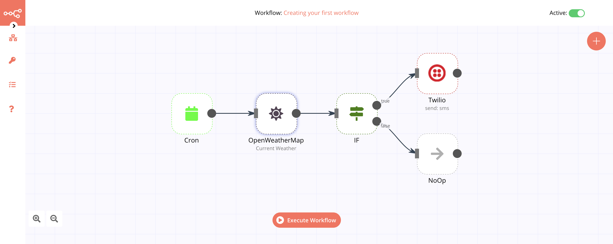
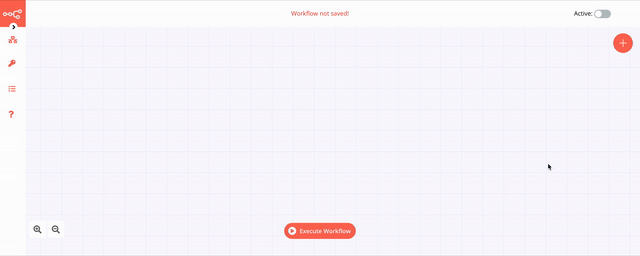
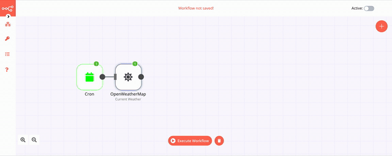
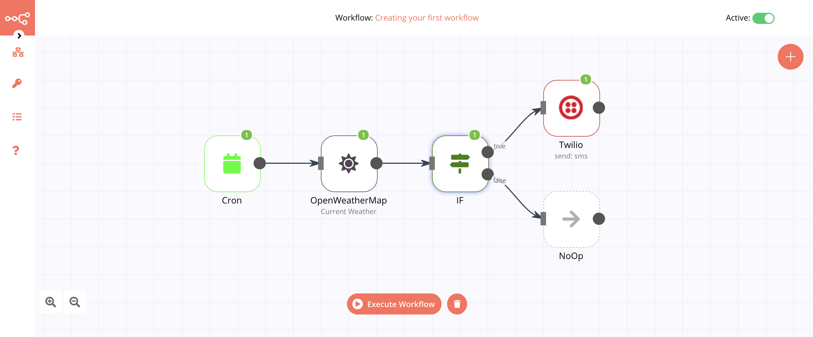

# Creating Your First Workflow

Let's create your first workflow in n8n. We'll create a workflow which will run every morning at 8 AM and will send an SMS to tell you if you should take a sweater with you. You can also find the [workflow](https://n8n.io/workflows/409) on n8n.io.

## Prerequisites

You’ll need the following tools and resources to complete the tutorial:

- **n8n** — You can find details on how to install n8n in the [Quickstart](quickstart.md) page.
- **OpenWeatherMap account** - You'll need to obtain an Access Token for the OpenWeatherMap API. You can find instructions on how to obtain that [here](../nodes/credentials/OpenWeatherMap/README.md).
- **Twilio account** - You'll need to obtain the Account SID and Auth Token for the Twilio API. You can find instructions on how to obtain that [here](../nodes/credentials/Twilio/README.md). You will also need a Twilio Phone Number. You can find information on how to obtain that [here](https://www.twilio.com/docs/usage/tutorials/how-to-use-your-free-trial-account).

**Note:** It might take a few minutes for the OpenWeatherMap API Access Token to activate.


## Building the Workflow

This workflow would use the following nodes.
- [Cron](../nodes/nodes-library/core-nodes/Cron/README.md) - Specify when the workflow should start (be triggered)
- [OpenWeatherMap](../nodes/nodes-library/nodes/OpenWeatherMap/README.md) - Get weather details for a particular city
- [IF](../nodes/nodes-library/core-nodes/IF/README.md) - Conditional logic to decide the flow of the workflow
- [Twilio](../nodes/nodes-library/nodes/Twilio/README.md) - Send an SMS
- [NoOp](../nodes/nodes-library/core-nodes/NoOperationDoNothing/README.md) - Do nothing (optional)

The final workflow should look like the following image.




### 1. Cron node

We'll use the *Cron* trigger node for starting the workflow. Add a *Cron* node by clicking on the + button on the top right of the Editor UI. Click on the *Cron* node under the section marked ***Trigger***.

Double click on the *Cron* node to enter the Node Editor. Click on the ***Add Cron Time*** button under the section marked ***Trigger Times***. Since we want the workflow to run every day at 8 AM, we'll set the ***Mode*** to 'Every Day' and the ***Hour*** to `8`.

Here's a GIF of me following the steps mentioned above.




### 2. OpenWeatherMap node

Add the *OpenWeatherMap* node by clicking on the + button and selecting the *OpenWeatherMap* node. Double click on the node and create credentials for the node by clicking on the ***Select Credentials*** dropdown list and selecting ***Create New***. Enter the ***Access Token*** that you obtained [earlier](#prerequisites).

We'll let the different fields stay as they are. I entered `berlin,de` in the ***City*** field. Feel free to enter another city's name. Click on the ***Execute Node*** button on the top right to get the data from the API. You can then see the data from the API in ***JSON*** or ***Table*** format.

Here's a GIF of me following the steps mentioned above.


### 3. IF node

Add the *IF* node by clicking on the + button and selecting the *IF* node. This is a conditional logic node that allows us to alter the flow of the workflow depending on the data that we get from the previous node(s).

Double click on the node, click on the ***Add Condition*** button, and select ***Number*** from the menu. Since the ***Value 1*** (temperature) would be a dynamic piece of information, click on the gears icon next to the field, and select ***Add Expression***.

This will open up the ***Variable Selector***. Delete the `0` in the ***Expression*** field on the right. From the left panel, select the following variable:

`Nodes > OpenWeatherMap > Output Data > JSON > main > feels_like`

For the ***Operation*** field, we'll let it be set to 'Smaller'. For the ***Value 2***, I entered `18`. This will ensure that the *IF* node returns true only if the weather is lower than 18°C. Feel free to change this to some other value. 

Here's a GIF of me following the steps mentioned above.




### 4. Twilio node

Add the *Twilio* node by clicking on the + button and selecting the *Twilio* node. Connect this node with the ***true*** output of the *IF* node.

Double click on the node and create credentials for the node by clicking on the ***Select Credentials*** dropdown list and selecting ***Create New***. Enter the ***Account SID*** and ***Auth Token*** that you obtained [earlier](#prerequisites).

In the ***From*** field, enter the Twilio phone number you obtained [earlier](#prerequisites) in [E.164](https://www.twilio.com/docs/glossary/what-e164) format.

In the ***To*** field, enter the mobile phone number you registered when you signed up for your Twilio account. (Twilio trial accounts can only send messages to registered phone numbers. To send messages to other numbers, upgrade to a regular account.) Use E.164 format for this number as well.

You can now add the message that you want to send yourself if the temperature is lower than 18°C. This is what I added in the ***Message*** field (you can click on ***Add Expression*** and paste this):

```
Wear a sweater today, it is {{$node["OpenWeatherMap"].json["main"]["feels_like"]}}°C outside right now.
```

Here's a GIF of me following the steps mentioned above.


### 5. NoOp node

If the temperature is greater than 18°C, we don't want the workflow to do anything. We'll use the *NoOp* node for that. Adding this node here is optional, as the absence of this node won't make a difference to the functioning of the workflow. Add the *NoOp* node by clicking on the + button and selecting the *NoOp* node. Connect this node with the ***false*** output of the *IF* node.

To test the workflow, click on the ***Execute Workflow*** button at the bottom of the Editor UI. I didn't get an SMS in my case since it was 24°C in Berlin at the time of writing this tutorial, and the workflow ended at the *NoOp* node.

Don't forget to save the workflow and then click on the ***Activate*** toggle on the top right of the screen to set it to true and activate the workflow. Here's a GIF of me following the steps mentioned above.


I raised the value of ***Value 2*** in the *IF* node from 18 to 27 to see what the SMS would look like. This is how the finished workflow and the SMS looked like. 

 

 


## Conclusion

Congratulations on creating your first workflow with n8n 🥳 

Did you run into any troubles while working on your first workflow? Don't be shy to ask questions or share the challenges you are facing in the community [forum](https://community.n8n.io/), we are all learners here 🙌

::: tip 🤝 Next Steps
Check out our tutorial on [Tracking Time Spent in Meetings With Google Calendar, Twilio, and n8n 🗓](https://medium.com/n8n-io/tracking-time-spent-in-meetings-with-google-calendar-twilio-and-n8n-a5d00f77da8c) to learn about automating the process of calculating your meeting time every week to give you a better idea of how your week is spent.
:::
