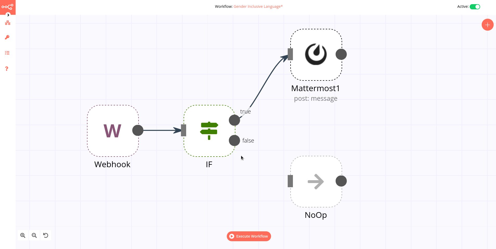

# Key Components

Before you start automating workflows with n8n, it's important to understand some key components and concepts.

## Editor UI

The [Editor UI](../reference/glossary.md#editor-ui) is the web interface used to create [workflows](#Workflow). It is accessed through a web browser at a designated website address.

From the Editor UI, you can access all your workflows and credentials, as well as the n8n documentation and forum.

### Workflows
1. Create a new workflow
2. Open the list of saved workflows
3. Save changes to the current workflow
4. Save the current workflow under a new name
5. Rename the current workflow
6. Delete the current workflow
7. Download the current workflow as a JSON file
8. Import a workflow from a URL
9. Import a workflow from a local file
10. View and change the settings of the current workflow

### Credentials
1. Create new credentials
2. Open the list of saved credentials

### Executions
Open the workflow executions log.

### Help
1. Open the n8n documentation page
2. Open the n8n community forum
3. Open the n8n public workflows page
4. View information about n8n (version, source code, license)

## Connection

A [connection](../reference/glossary.md#connection) establishes a link between nodes to route data through the workflow. A connection between two nodes passed data from one node's output to another node's input. Each node can have one or multiple connections. To create a connection between two nodes, click on the grey dot on the right side of the node and slide the arrow to the grey rectangle on the left side of the following node.  

*Example:* An [IF node](../nodes/nodes-library/core-nodes/If/README.md) has two connections to different nodes: one for the case when the statement is true and one for the case when the statement is false.

## Node

A [node](../reference/glossary.md#node) is an entry point for retrieving data, a function to process data, or an exit for sending data. The data process includes filtering, recomposing, and changing data. There can be one or several nodes for your API, service, or app. By connecting multiple nodes, you can create simple and complex workflows. When you add a node to the Editor UI, the node is automatically activated an requires you to configure it (i.e., add credentials, expressions, etc.).

There are three types of nodes:

* Core Nodes
* Regular Nodes
* Trigger Nodes

### Core Nodes

Core nodes are functions or services that can be used to control how workflows are run or to provide generic API support. If an application you need does not have a dedicated Node yet, you can access the data by using the [HTTP Request node](../nodes/nodes-library/core-nodes/HTTPRequest/README.md) or the [Webhook node](../nodes/nodes-library/core-nodes/Webhook/README.md).

Use the Start node when you want to manually trigger the workflow with the `Execute Workflow` button at the bottom of the Editor UI. This way of starting the workflow with the Start node is useful for creating and testing workflows.

### Regular Nodes

Regular nodes perform an action, like fetching data or creating an entry in a calendar. Regular nodes are named like the application they represent and are listed under Regular Nodes in the Editor UI.

*Example:* A [Google Sheets node](../nodes/nodes-library/nodes/GoogleSheets/README.md) can be used to retrieve or write data to a Google Sheet.

### Trigger Nodes

[Trigger nodes](../reference/glossary.md#trigger) start workflows and supply the initial data. 

Trigger nodes can be app or core nodes.

* **App Trigger nodes** start the workflow when an event happens in an app. App Trigger nodes are named like the application they represent followed by "Trigger" and are listed under Trigger Nodes in the Editor.

*Example:* A [Telegram trigger node](../nodes/nodes-library/nodes/Trello/README.md) can be used to trigger a workflow when a message is sent in a Telegram chat.

* **Core Trigger nodes** start the workflow at a specific time, at a time interval, or on a webhook call.

*Example:* To get all users from a Postgres database every 10 minutes, use the Interval Trigger node with the Postgres node.

### Setting up a node

Each node has various parameters that cou can configure to perform one or more actions. Double-click on the node to open the parameter configuration. 

## Workflow

A [workflow](../reference/glossary.md#workflow) is a collection of node connected together to automate a process. A workflow can be started manually or by trigger nodes. A workflow run ends when all active and connected nodes have processed their data. Once you created a workflow, you need to activate it, so that it is executed every time a trigger condition is met. An execution is a run of the workflow. You can view all the executions of your workflows in the **Execution log**. Reviewing past workflow executions can be helpful for debugging. 

