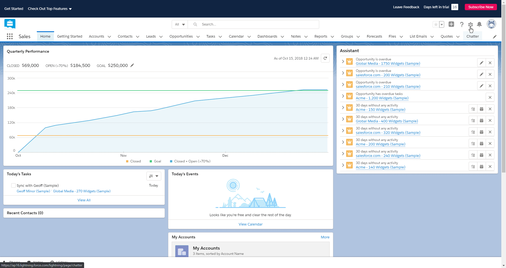

# Salesforce

You can use these credentials to authenticate the following nodes with Salesforce.
- [Salesforce](../../nodes-library/nodes/Salesforce/README.md)

## Prerequisites

Create a [Salesforce](https://www.salesforce.com/) account.

## Using OAuth

::: tip ⛅️ Note for n8n.cloud users
You'll only need to enter the Credentials Name and click on the circle button in the OAuth section to connect your Salesforce account to n8n.
:::

1. Access your Salesforce Dashboard.
2. Click on the gear icon in the top right and select ***Setup*** from the dropdown list.
3. In the ***Platform Tools*** category of the sidebar, select ***App Manager*** under the ***Apps*** section.
4. Click on the ***New Connected App*** button.
5. Enter any necessary information and click on the ***Enable OAuth Settings*** checkbox.
6. Copy the ***OAuth Callback URL*** provided in the 'Salesforce OAuth2 API' credentials in n8n.
7. On the Salesforce app creation page, paste the URL in the ***Callback URL*** field.
8. Add the "Perform requests on your behalf at any time (refresh_token, offline_access)" scope in the ***Selected OAuth Scopes*** section.
9. Add any other scopes you plan to use in the  ***Selected OAuth Scopes*** section.
10. Click on the ***Save*** button at the bottom of the page.
11. On the ***New Connected App*** page, click on the ***Continue*** button.
12. In the 'API (Enable OAuth Settings)' section of the page, click on the ***Click to reveal*** button to reveal the consumer secret.
13. Copy the displayed ***Consumer Key*** and the ***Consumer Secret*** and use these with your Salesforce OAuth2 API credentials in n8n.
14. Copy the part of the URL between `https://` and `.salesforce.com` and replace 'yourcompany' in the ***Access Token URL*** in your Salesforce OAuth2 API credentials in n8n.
15. Click on the circle button in the OAuth section to connect a Salesforce account to n8n.
16. Click on the ***Save*** button to save your credentials.

