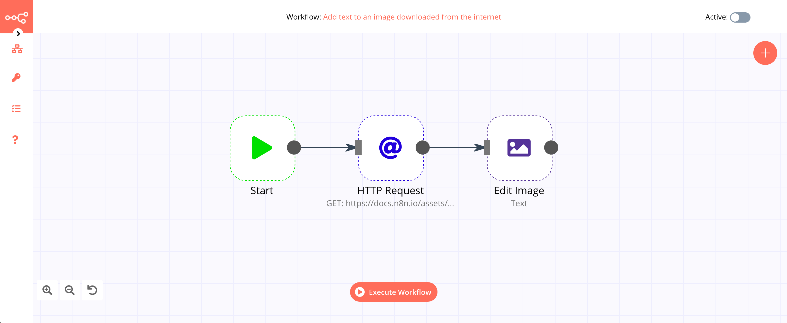
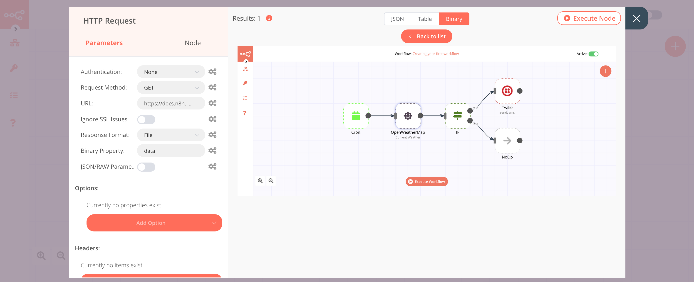
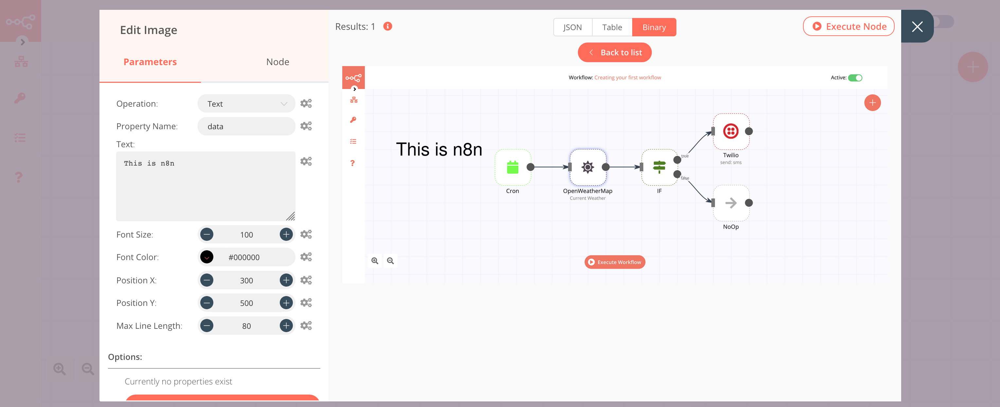

# Edit Image

The Edit Image node is used to manipulate and edit images.

::: tip 💡 Keep in mind
1. If you are not running n8n on Docker, you'll need to install [GraphicsMagick](http://www.graphicsmagick.org/README.html).
2. You will need to use an additional node such as the [Read Binary File](../../core-nodes/ReadBinaryFile/README.md) node or the [HTTP Request](../../core-nodes/HTTPRequest/README.md) node to pass the image file as a data property to the Edit Image node.
:::

## Node Reference

- Operations
	- Add a blur to the image to reduce sharpness
	- Add a border to the image
	- Crop the image
	- Get information about the image
	- Rotate the image
	- Change the size of the image
	- Add text to the image

You can also specify a file format using the *Format* field in the *Add Option* dropdown list.

- Options
	- ***File Name*** field: Allows you to specify the filename of the output file.
	- ***Format*** field: Allows you to specify the image format of the output file:
		- BMP
		- GIF
		- JPEG
		- PNG
		- TIFF

## Example Usage

This workflow allows you to add text to an image downloaded from the internet using the Edit Image node. You can also find the [workflow](https://n8n.io/workflows/591) on n8n.io. This example usage workflow would use the following nodes.
- [Start](../../core-nodes/Start/README.md)
- [HTTP Request](../../core-nodes/HTTPRequest/README.md)
- [Edit Image]()

The final workflow should look like the following image.

### 1. Start node

The start node exists by default when you create a new workflow.

### 2. HTTP Request node

1. Enter `https://docs.n8n.io/assets/img/final-workflow.f380b957.png` in the ***URL*** field.
2. Select 'File' from the ***Response Format*** dropdown list.
3. Click on *Execute Node* to run the node.

### 3. Edit Image node

1. Select 'Text' from the ***Operation*** dropdown list.
2. Enter `This is n8n`in the ***Text*** field.
3. Enter 100 in the ***Font Size*** field.
4. Enter 300 in the ***Position X*** field.
5. Enter 500 in the ***Position Y*** field.
6. Click on *Execute Node* to run the node.

