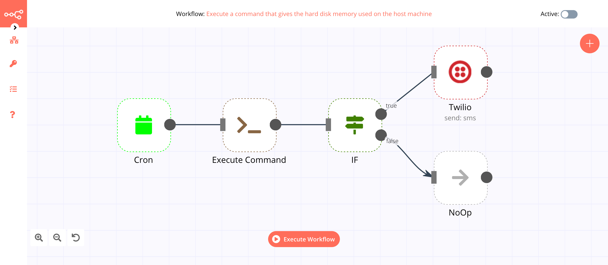

# Execute Command

The Execute Command node is used to run shell commands on the host machine that runs n8n.

::: tip 💡 Keep in mind
1. If you are running n8n in Docker, your command will run on the n8n container and not the Docker host.
2. This node will execute the command in the default shell of the host machine. For example, this will be PowerShell on Windows and zsh on macOS.
:::

## Node Reference

The Execute Command node has two properties:
1. *Execute Once* toggle: This is a boolean field that is used to specify whether you want the node to execute only once, or once for every item it receives an input.
2. *Command* field: This is a text field that is used to specify the command that will be executed on the host machine.


## Example Usage

This workflow allows you to execute commands on the host machine using the Execute Command node. You can also find the [workflow](https://n8n.io/workflows/570) on the website. This example usage workflow would use the following two nodes.
- [Start](../../core-nodes/Start/README.md)
- [Execute Command]()


The final workflow should look like the following image.



### 1. Start node

The start node exists by default when you create a new workflow.

### 2. Execute Command node

1. Enter the command that you want to execute in the *Command* field.
2. Click on *Execute Node* to run the workflow.

## FAQs

### How to run multiple commands in the Execute Command node?
You can combine multiple commands using `&&`. For example, you can combine the change directory(cd) command with the list(ls) command using `&&`.
```bash
cd bin && ls
```
### How to run ssh commands in the Execute Command node?
You will have to build a Docker image based on the existing n8n image. The default n8n Docker image uses Alpine Linux. You will have to install the OpenSSH package.
1. Create a file named Dockerfile.
2. Add the below code snippet to the Dockerfile.
```
FROM n8nio/n8n
RUN apk --update add openssh
```
3. In the same folder, execute the command below command to build the Docker image.
```
docker build -t n8n-ssh
```
4. Replace the Docker image you used before. For example, replace `n8nio/n8n` with `n8n-ssh`.
5. Run the newly created Docker image, and you will now be able to execute ssh via the Execute Command-Node.

An alternate solution is to use the n8n-ubuntu image. To use the n8n-ubuntu image replace `n8nio/n8n` with `n8nio/n8n:<N8N_VERSION>-ubuntu`.

### How to run the curl command in the Execute Command node?
You will have to build a Docker image based on the existing n8n image. The default n8n Docker image uses Alpine Linux. You will have to install the curl package. 
1. Create a file named Dockerfile.
2. Add the below code snippet to the Dockerfile.
```
FROM n8nio/n8n
RUN apk --update add curl
```
3. In the same folder, execute the command below command to build the Docker image.
```
docker build -t n8n-curl
```
4. Replace the Docker image you used before. For example, replace `n8nio/n8n` with `n8n-curl`.
5. Run the newly created Docker image, and you will now be able to execute ssh via the Execute Command-Node.
