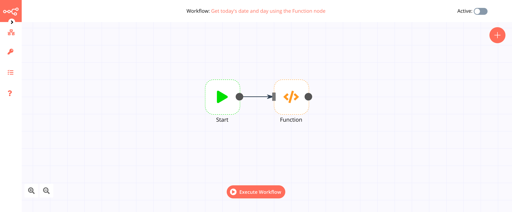

# Function

The Function node is used to add custom snippets to JavaScript code to transform data from the other nodes or if you want to implement some custom functionality that n8n doesn’t support yet.

::: tip 💡 Keep in mind
Please note that the Function node is different from the [Function Item](../FunctionItem/README.md) node. Check out [this](../../../../reference/function-nodes.md) page to learn about the difference between the Function and Function Item nodes.
:::

If you want to use the Function node to transform input data, check out how n8n's [data structure](../../../../reference/data/data-structure.md) looks like. The Function node also supports promises. So instead of returning the items directly, it is also possible to return a promise which resolves accordingly.

The Function node also provides the ability to write to your browser console using `console.log`, useful for debugging and troubleshooting your workflows.

## Example Usage

This workflow allows you to get today's date and day using the Function node. You can also find the [workflow](https://n8n.io/workflows/524) on the website. This example usage workflow would use the following two nodes.
- [Start](../../core-nodes/Start/README.md)
- [Function]()


The final workflow should look like the following image.



### 1. Start node

The start node exists by default when you create a new workflow.

### 2. Function node

1. Paste the following JavaScript code snippet in the *Function* field.
```javascript
var date = new Date().toISOString();
var day = new Date().getDay();
const weekday = ["Sunday", "Monday", "Tuesday", "Wednesday", "Thursday", "Friday", "Saturday"];

items[0].json.date_today = date;
items[0].json.day_today = weekday[day];

return items;
```
2. Click on *Execute Node* to run the workflow.


## Node Reference

You can also use the methods and variables mentioned in the [Expressions](../../../expressions.md) page in the Function node.

### Variable: items

It contains all the items that the node has received as an input.

Information about how the data is structured can be found on [this](../../../../reference/data/data-structure.md) page about data structures.

The data can be accessed and manipulated like this:

```typescript
// Sets the JSON data property "myFileName" of the first item to the name of the
// file which is set in the binary property "image" of the same item.
items[0].json.myFileName = items[0].binary.image.fileName;

return items;
```

This example creates 10 dummy items with the ids 0 to 9:

```typescript
const newItems = [];

for (let i=0;i<10;i++) {
  newItems.push({
    json: {
      id: i
    }
  });
}

return newItems;
```


### Method: $item(index: number, runIndex?: number)

With `$item` it is possible to access the data of parent nodes. That can be the item data but also
the parameters. It expects as input an index of the item the data should be returned for. This is
needed because for each item the data returned can be different. This is probably straightforward for the
item data itself but maybe less for data like parameters. The reason why it is also needed, is
that they may contain an expression. Expressions get always executed of the context for an item.
If that would not be the case, for example, the Email Send node not would be able to send multiple
emails at once to different people. Instead, the same person would receive multiple emails.

The index is 0 based. So `$item(0)` will return the first item, `$item(1)` the second one, and so on.

By default the item of the last run of the node  will be returned. So if the referenced node ran
3x (its last runIndex is 2) and the current node runs the first time (its runIndex is 0) the
data of runIndex 2 of the referenced node will be returned.

For more information about what data can be accessed via `$node`, check out the `Variable: $node` [section](../../../expressions.md#variable-node).

Example:

```typescript
// Returns the value of the JSON data property "myNumber" of Node "Set" (first item)
const myNumber = $item(0).$node["Set"].json["myNumber"];
// Like above but data of the 6th item
const myNumber = $item(5).$node["Set"].json["myNumber"];

// Returns the value of the parameter "channel" of Node "Slack".
// If it contains an expression the value will be resolved with the
// data of the first item.
const channel = $item(0).$node["Slack"].parameter["channel"];
// Like above but resolved with the value of the 10th item.
const channel = $item(9).$node["Slack"].parameter["channel"];
```


### Method: getWorkflowStaticData(type)

This gives access to the static workflow data.
It is possible to save data directly with the workflow. This data should, however, be very small.
A common use case is to for example to save a timestamp of the last item that got processed from
an RSS-Feed or database. It will always return an object. Properties can then read, delete or
set on that object. When the workflow execution succeeds, n8n will check automatically if the data
has changed and will save it, if necessary.

There are two types of static data. The "global" and the "node" one. Global static data is the
same in the whole workflow. And every node in the workflow can access it. The node static data
, however, is different for every node and only the node which set it can retrieve it again.

Example:

```javascript
// Get the global workflow static data
const staticData = getWorkflowStaticData('global');
// Get the static data of the node
const staticData = getWorkflowStaticData('node');

// Access its data
const lastExecution = staticData.lastExecution;

// Update its data
staticData.lastExecution = new Date().getTime();

// Delete data
delete staticData.lastExecution;
```

It is important to know that the static data can not be read and written when testing via the UI.
The data there will always be empty and the changes will not persist. Only when a workflow
is active and it gets called by a Trigger or Webhook, the static data will be saved.

## Further Reading

<FurtherReadingBlog />
