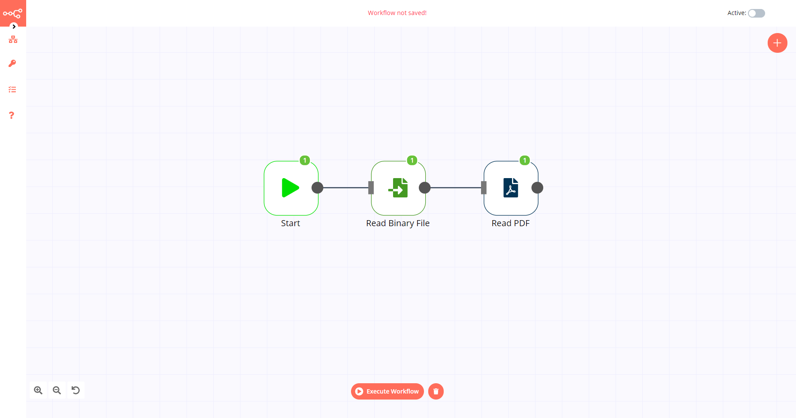

# Read PDF

The Read PDF node is used to read data from PDF documents and extract its content as text.

::: tip 💡 Keep in mind
You will need to use an additional node such as the [Read Binary File](../../core-nodes/ReadBinaryFile/README.md) node or the [HTTP Request](../../core-nodes/HTTPRequest/README.md) node to pass the image file as a data property to the Read PDF node.
:::

## Node Reference

The Read PDF node has one property:

1. *Binary Property* field: This field specifies the name of the data property used to read the PDF file in n8n.

## Example Usage

This workflow allows you to read a PDF file using the Read PDF node. You can also find the [workflow](https://n8n.io/workflows/585) on the website. This example usage workflow would use the following three nodes.
- [Start](../../core-nodes/Start/README.md)
- [Read Binary File](../../core-nodes/ReadBinaryFile/README.md)
- [PDF Read]()

The final workflow should look like the following image.

### 1. Start node

The start node exists by default when you create a new workflow.

### 2. Read Binary File
1. Enter the path to the PDF file you want to read in the *File Path* field.

### 3. Read PDF node

1. Enter the *Property Name* you used in the previous node in the *Binary Property* field.
2. Click on *Execute Node* to run the workflow.
