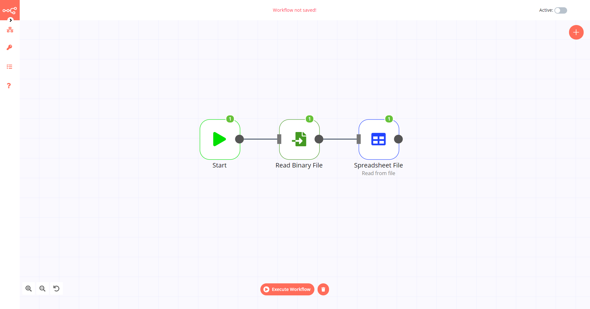

# Spreadsheet File

The Spreadsheet File node is used to access data from spreadsheet files.

::: tip 💡 Keep in mind
1. You will need to use an additional node such as the [Read Binary File](../../core-nodes/ReadBinaryFile/README.md) node or the [HTTP Request](../../core-nodes/HTTPRequest/README.md) node to pass the image file as a data property to the Spreadsheet File node.
:::

## Basic Operations

- Read from file
- Write to file

## Node Reference

- **Binary Property:** This is a text field used to specify the name of the data property used to read the spreadsheet file in n8n.

When writing to a spreadsheet file, the additional *File Format* property is available.

- File Format
	- CSV (Comma-separated values)
	- HTML (HTML Table)
	- ODS (OpenDocument Spreadsheet)
	- RTF (Rich Text Format)
	- XLS (Excel)
	- XLSX (Excel)

**Options**
- **Sheet Name:** This is a text field used to specify the name of the sheet from which the data should be read or written to.
- **Read As String:** This is a toggle that enables you to parse all input data as strings.
- **RAW Data:** This is a toggle that enables you to skip the parsing of data.
- **File Name:** This is a text field used to specify a custom file name when writing a spreadsheet file to disk.

## Example Usage

This workflow allows you to read a spreadsheet file using the Spreadsheet File node. You can also find the [workflow](https://n8n.io/workflows/586) on the website. This example usage workflow would use the following three nodes.
- [Start](../../core-nodes/Start/README.md)
- [Read Binary File](../../core-nodes/ReadBinaryFile/README.md)
- [Spreadsheet File]()

The final workflow should look like the following image.

### 1. Start node

The start node exists by default when you create a new workflow.

### 2. Read Binary File
1. Enter the path to the spreadsheet file you want to read in the *File Path* field.

### 3. Spreadsheet File node

1. Enter the *Property Name* you used in the previous node in the *Binary Property* field.
2. Click on *Execute Node* to run the workflow.
