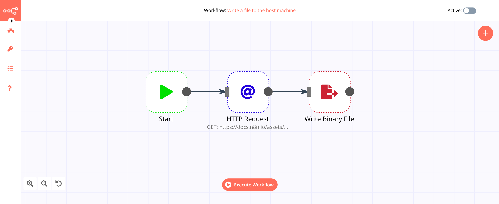
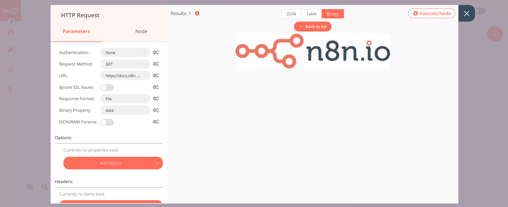

# Write Binary File

The Write Binary File node is used to write a file to the host machine that runs n8n.

::: tip 💡 Keep in mind
1. If you are running n8n in Docker, your command will run on the n8n container and not the Docker host.
2. This node will look for files relative to the n8n install path. It is recommended to use absolute file paths to prevent any errors.
:::

## Node Reference

1. ***File Name*** field: This field specifies the path to which the file should be written, along with the file name.
2. ***Property Name*** field: Name of the binary property to which to write the data of the read file.

## Example Usage

This workflow allows you to write a file to the host machine using the Write Binary File node. You can also find the [workflow](https://n8n.io/workflows/590) on the website. This example usage workflow would use the following three nodes.
- [Start](../../core-nodes/Start/README.md)
- [HTTP Request](../../core-nodes/HTTPRequest/README.md)
- [Write Binary File]()

The final workflow should look like the following image.

### 1. Start node

The start node exists by default when you create a new workflow.

### 2. HTTP Request node

1. Enter `https://docs.n8n.io/assets/img/n8n-logo.png` in the ***URL*** field.
2. Select the 'File' option from the ***Response Format*** dropdown list. 
3. Click on ***Execute Node*** to run the node.

### 3. Write Binary File node

1. Enter the path to which the file should be written along with the file name in the ***File Name*** field.
2. Click on ***Execute Node*** to run the node.
