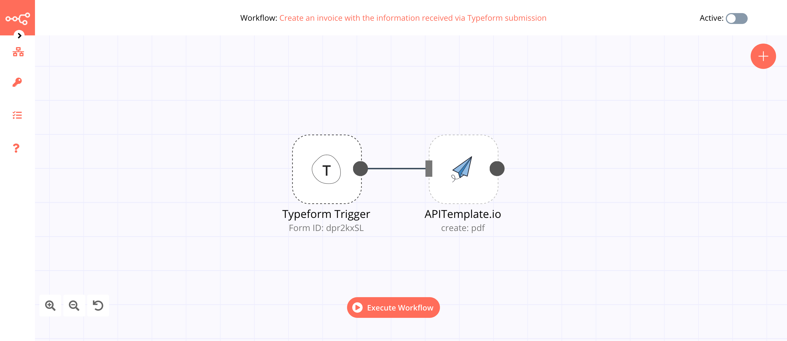
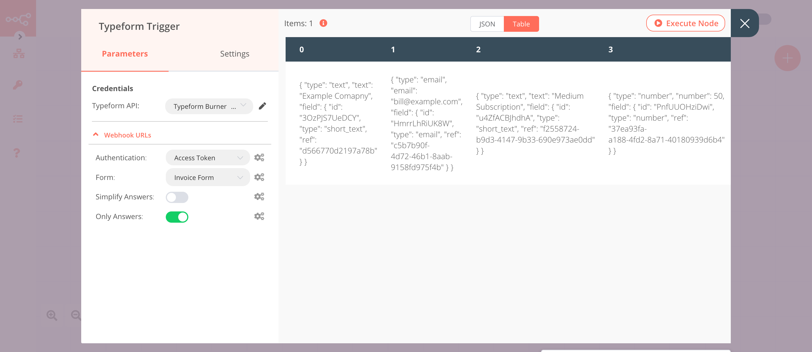
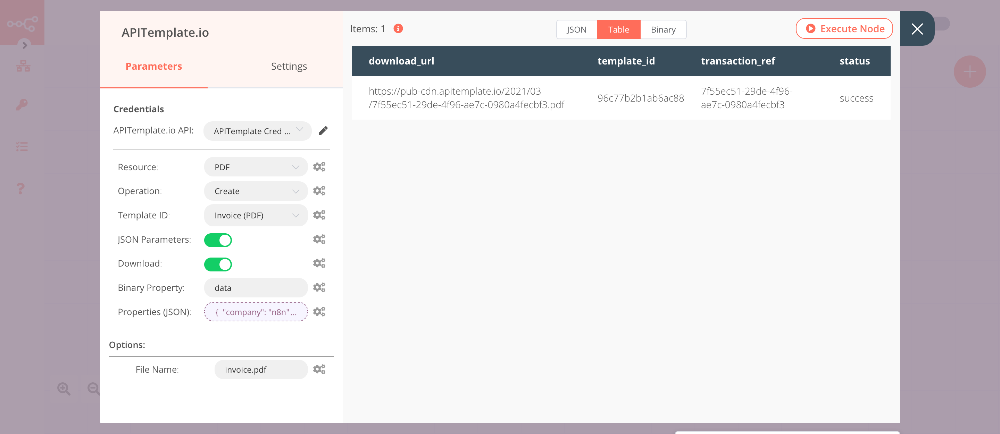

# APITemplate.io

[APITemplate.io](https://apitemplate.io) allows you to auto-generate images and PDF documents.

::: tip 🔑 Credentials
You can find authentication information for this node [here](../../../credentials/APITemplateIo/README.md).
:::

## Basic Operations

<Resource node="n8n-nodes-base.apiTemplateIo" />

## Example Usage

This workflow allows you to create an invoice with the information received via a Typeform submission. You can also find the [workflow](https://n8n.io/workflows/989) on n8n.io. This example usage workflow would use the following nodes.
- [Typeform Trigger](../../trigger-nodes/TypeformTrigger/README.md)
- [APITemplate.io]()

The final workflow should look like the following image.



### 1. Typeform Trigger node

This node will trigger the workflow when a form is submitted. Make sure to create a form that collects the following information:
- Bill To (Short Text)
- Client's Email Address (Email)
- Item Description (Short Text)
- Item Price (Number)
- Item Description (Short Text)
- Item Price (Number)

1. Select 'Access Token' from the ***Authentication*** dropdown list.
2. Enter the credentials for the Typeform Trigger node. You can find out how to do that [here](../../../credentials/Typeform/README.md).
3. Select the invoice form from the ***Form*** dropdown list.
4. Toggle ***Simplify Answers*** to `false`. By setting this option to false, the node returns the values for the fields with duplicate names.
5. Click on ***Execute Node*** to run the node.

In the screenshot below, you will notice that the node triggers the workflow when the form is submitted. We will pass this information to the next nodes in the workflow.



### 2. APITemplate.io node (create: pdf)

This node will generate an invoice using the information from the previous node. Create an invoice template in APITemplate.io, if you don't already have one.

1. First of all, you'll have to enter credentials for the APITemplate.io node. You can find out how to do that [here](../../../credentials/APITemplateIo/README.md).
2. Select 'PDF' from the ***Resource*** dropdown list.
3. Select your invoice template from the ***Template ID*** dropdown list.
4. Toggle ***JSON Parameters*** to `true`. By setting this option to true, the node allows us to write custom JSON data.
5. Toggle ***Download*** to `true`.
6. Click on the gears icon next to the ***Properties (JSON)*** field.
7. Enter the following expression in the ***Edit Expression*** field:
```json
{
  "company": "n8n",
  "email": "{{$json["1"]["email"]}}",
  "invoice_no": "213223444",
  "invoice_date": "18-03-2021",
  "invoice_due_date": "17-04-2021",
  "address": "Berlin, Germany",
  "company_bill_to": "{{$json["0"]["text"]}}",
  "website": "https://n8n.io",
  "document_id": "889856789012",
  "items": [
    {
      "item_name": "{{$json["2"]["text"]}}",
      "price": "EUR {{$json["3"]["number"]}}"
    },
    {
      "item_name": "{{$json["4"]["text"]}}",
      "price": "EUR {{$json["5"]["number"]}}"
    }
    ]
}
```
8. Click on the ***Add Field*** button.
9. Enter a file name in the ***File Name*** field.
10. Click on ***Execute Node*** to run the node.

In the screenshot below, you will notice that the node creates an invoice using the data from the previous node.



::: tip 💡 Activate workflow for production
You'll need to save the workflow and then click on the Activate toggle on the top right of the screen to activate the workflow. Your workflow will then be triggered as specified by the settings in the Typeform Trigger node.
:::
