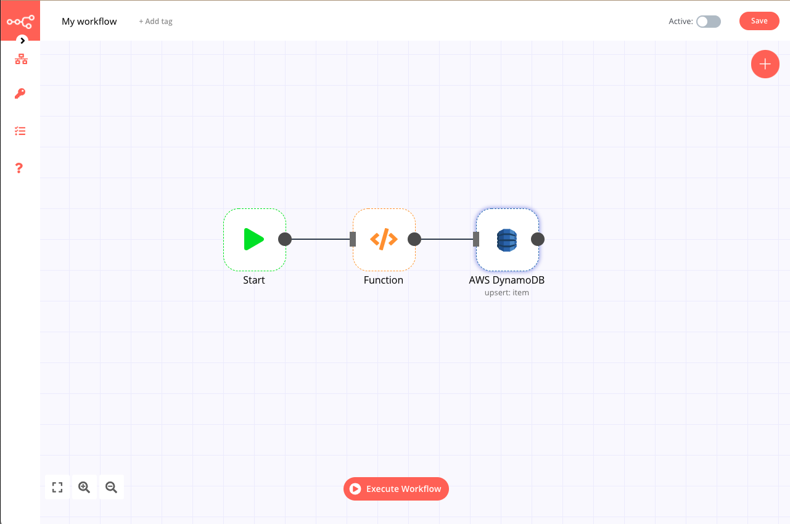

# AWS DynamoDB

[AWS DynamoDB](https://aws.amazon.com/DynamoDB/) is a key-value and document database provided by Amazon as a part of Amazon Web Services.

::: tip 🔑 Credentials
You can find authentication information for this node [here](../../../credentials/AWS/README.md).
:::

## Basic operations

<Resource node="n8n-nodes-base.awsDynamoDb" />

## Example usage

This workflow allows you to insert an item into your DynamoDB database. This example usage workflow would use the following two nodes.
- [Start](../../core-nodes/Start/README.md)
- [Function](../../core-nodes/Function/README.md)
- [AWS DynamoDB]()

The final workflow should look like the following image.



### 1. Start node

The start node exists by default when you create a new workflow.

### 2. Function node

The function node will return the item to insert, [properly formatted](https://docs.aws.amazon.com/amazondynamodb/latest/APIReference/API_AttributeValue.html) for our table structure `id: number`.

1. Enter the following snippet:
    ```js
    return [
      {
        json: {
          id: {
            'N': '1'
          }
        }
      }
    ]
    ```

### 3. AWS DynamoDB node

1. First enter credentials for the AWS DynamoDB node. You can find out how to do that [here](../../../credentials/AWS/README.md).
2. The **Item** ***Resource*** is selected by default.
3. Select the **Create or Update** ***Operation***.
4. Enter the ***Table Name*** where you are inserting data.
5. In ***Data to Send*** select **Define Below for Each Column**.
6. Click on *Execute Node* to run the workflow.
