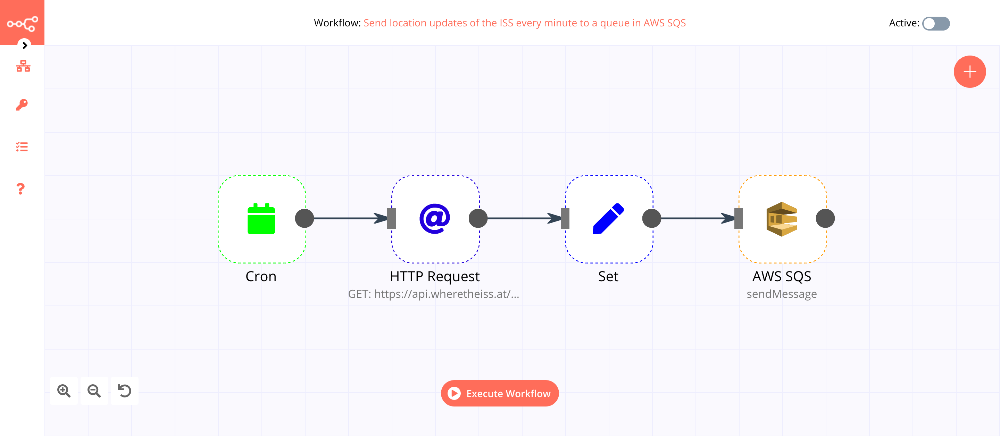
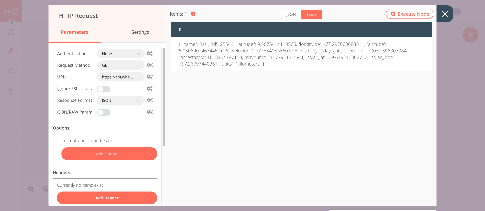
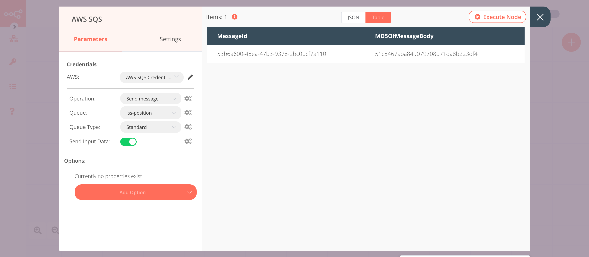

# AWS SQS

[AWS SQS](https://aws.amazon.com/sqs/) is a fully managed message queuing service that enables you to decouple and scale microservices, distributed systems, and serverless applications.

::: tip 🔑 Credentials
You can find authentication information for this node [here](../../../credentials/AWS/README.md).
:::

## Basic Operations

- Send Message

## Example Usage

This workflow allows you to detect a face from an image using the AWS SQS node. You can also find the [workflow](https://n8n.io/workflows/694) on n8n.io. This example usage workflow uses the following nodes.
- [Start](../../core-nodes/Start/README.md)
- [HTTP Request](../../core-nodes/HTTPRequest/README.md)
- [AWS SQS]()

The final workflow should look like the following image.

### 1. Start node

The Start node exists by default when you create a new workflow.

### 2. HTTP Request node (GET)

This example workflow uses the HTTP Request node to fetch an image from a URL. You can also use the [Read Binary File](../../core-nodes/ReadBinaryFile/README.md) node to read an image file from the path you specify.

1. Enter the URL of the image in the ***URL*** field. For example, `https://n8n.io/_nuxt/img/04c67e5.png`.
2. Select 'File' from the ***Response Format*** dropdown list.
3. Click on ***Execute Node*** to run the node.

In the screenshot below, you will notice that the HTTP Request node fetches the image from the URL. This image gets passed on as binary data to the next node in the workflow.

### 3. AWS SQS node (analyze: image)

This node will detect faces in the image that we fetched in the previous node. You can also use this node to analyze an image stored in your AWS Bucket.

1. First of all, you'll have to enter credentials for the AWS SQS node. You can find out how to enter credentials for this node [here](../../../credentials/AWS/README.md).
2. Set ***Binary Data*** to `true`.
3. Click on ***Execute Node*** to run the node.

In the screenshot below, you will observe that the node detects the face in the image that we got from the HTTP Request node.

