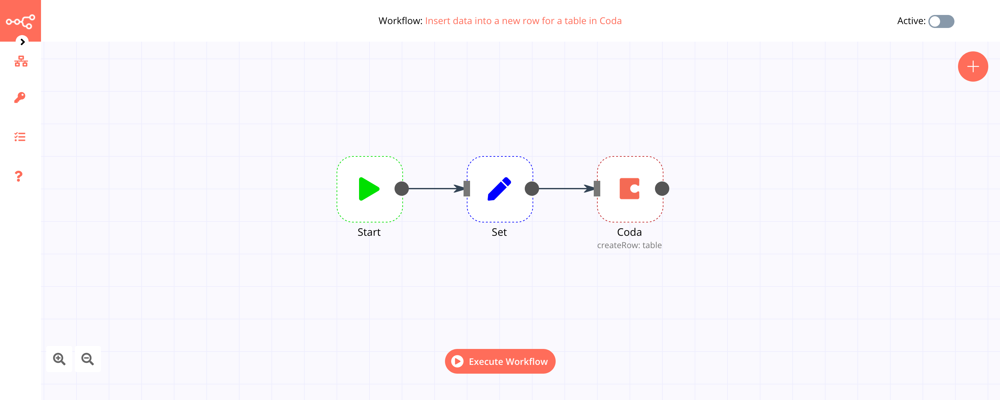

# Coda

[Coda](https://coda.io/) is a new type of document that blends the flexibility of documents, the power of spreadsheets, and the utility of applications into a single new canvas. 

::: tip 🔑 Credentials
You can find authentication information for this node [here](../../../credentials/Coda/README.md).
:::

## Basic Operations

- Control
    - Get a control
    - Get all controls
- Formula
    - Get a formula
    - Get all formulas
- Table
    - Create/Insert a row
    - Delete one or multiple rows
    - Get all columns
    - Get all the rows
    - Get a column
    - Get row
    - Pushes a button
- View
    - Delete view row
    - Get a view
    - Get all views
    - Get all views columns
    - Get all views rows
    - Update row
    - Push view button

## Example Usage

This workflow allows you to insert data into a new row for a table in Coda. You can also find the [workflow](https://n8n.io/workflows/482) on the website. This example usage workflow would use the following three nodes.
- [Start](../../core-nodes/Start/README.md)
- [Set](../../core-nodes/Set/README.md)
- [Coda]()

The final workflow should look like the following image.

### 1. Start node

The start node exists by default when you create a new workflow.

### 2. Set node

1. Click on the *Add Value* button and select 'String' from the dropdown list.
2. Enter `Column 1`in the *Name* field.
3. Enter the value for the first column in the *Value* field.
4. Repeat the first three steps of all the columns that you have in your Coda table. 

**Note:** Here, we've used the default table in Coda, which has three columns namely Column 1, Column 2, and Column 3. Please make sure that the column names in the *Name* field matches the names of the table columns in Coda.

### 3. Coda node

1. First of all, you'll have to enter credentials for the Coda node. You can find out how to do that [here](../../../credentials/Coda/README.md).
2. Select the name of your document from the *Doc* dropdown list.
w. Select the name of your table from the *Table* dropdown list.
4. Click on *Execute Node* to run the workflow.
