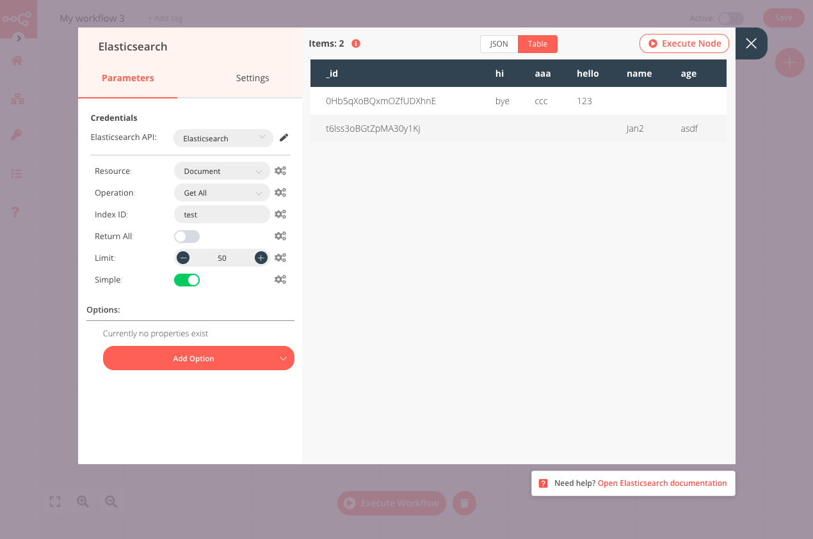

# Elasticsearch

[Elasticsearch](https://www.elastic.co/) is a distributed, free and open search and analytics engine for all types of data, including textual, numerical, geospatial, structured, and unstructured.

::: tip 🔑 Credentials
You can find authentication information for this node [here](../../../credentials/Elasticsearch/README.md).
:::

## Basic operations

<Resource node="n8n-nodes-base.elasticsearch" />

## Example usage

This workflow allows you to get all documents for a selected index. This example usage workflow uses the following nodes.
- [Start](../../core-nodes/Start/README.md)
- [Elasticsearch]()

The final workflow should look like the following image.

### 1. Start node

The Start node exists by default when you create a new workflow.

### 2. Elasticsearch node

1. First enter credentials for the Elasticsearch node. You can find out how to do that [here](../../../credentials/Elasticsearch/README.md).
2. Select **Document** from the ***Resource*** dropdown.
3. Select **Get All** from the ***Operation*** dropdown.
3. Enter the ID of your desired index in the ***Index ID*** field.
4. Click on ***Execute Node*** to run the node.

