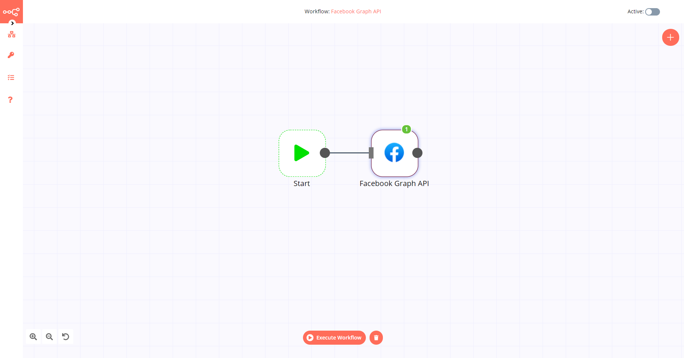

# Facebook Graph API

[Facebook](https://www.facebook.com/) is a social networking site that makes it easy to connect and share with family and friends online.

::: tip 🔑 Credentials
You can find authentication information for this node [here](../../../credentials/FacebookGraphAPI/README.md).
:::

## Basic operations

::: details Default
- GET
- POST
- DELETE 
:::

::: details Video Uploads
- GET
- POST
- DELETE 
:::

### Parameters

* **Host URL**: The host URL for the request. The following options are available:
    * **Default**: Requests are passed to the `graph.facebook.com` host URL. Used for the majority of requests.
    * **Video**: Requests are passed to the `graph-video.facebook.com` host URL. Used for video upload requests only.
* **HTTP Request Method**: The method to be used for this request, from the following options:
    * **GET**
    * **POST**
    * **DELETE**
* **Graph API Version**: The version of the [Facebook Graph API](https://developers.facebook.com/docs/graph-api/changelog) to be used for this request.
* **Node**: The node on which to operate, for example `/<page-id>/feed`. Read more about it in the [official Facebook Developer documentation](https://developers.facebook.com/docs/graph-api/using-graph-api).
* **Edge**: Edge of the node on which to operate. Edges represent collections of objects which are attached to the node.
* **Ignore SSL Issues**: Toggle to still download the response even if SSL certificate validation is not possible.
* **Send Binary Data**: Available for `POST` operations. If enabled binary data is sent as the body. Requires setting the following:
    * **Binary Property**: Name of the binary property which contains the data for the file to be uploaded.

## Example usage

This workflow allows you to retrieve the first and last name of a profile on Facebook. You can also find the [workflow](https://n8n.io/workflows/514) on the website. This example usage workflow would use the following two nodes.
- [Start](../../core-nodes/Start/README.md)
- [Facebook Graph API]()

The final workflow should look like the following image.

### 1. Start node

The start node exists by default when you create a new workflow.

### 2. Facebook Graph API node

1. First of all, you'll have to enter credentials for the Facebook Graph API node. You can find out how to do that [here](../../../credentials/FacebookGraphAPI/README.md).
2. Enter `me` in the *Node* field.
3. Click on the *Add Option* button and select 'Fields' from the dropdown list.
4. Click on the *Add Field* button and enter `first_name` in the *Name* field.
5. Click on the *Add Field* button and enter `last_name` in the *Name* field.
6. Click on *Execute Node* to run the workflow.
