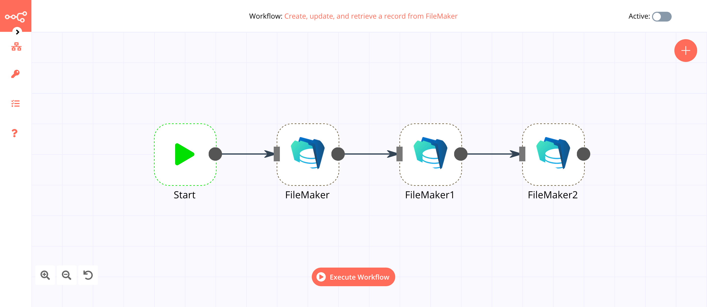
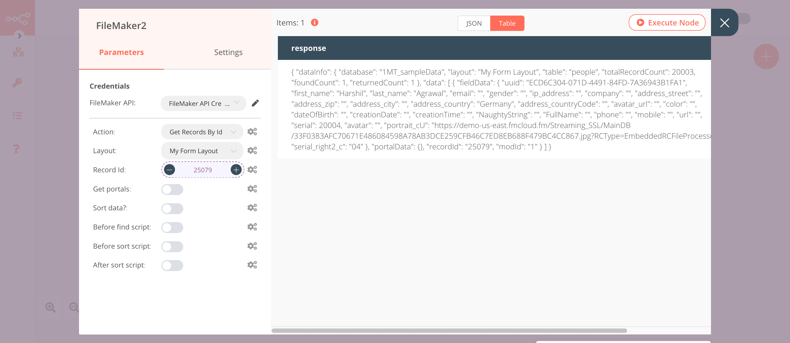
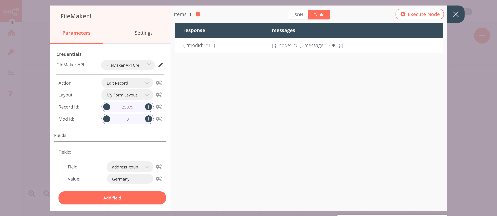
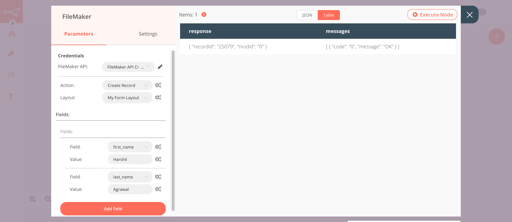

# FileMaker

[FileMaker](https://www.claris.com/filemaker/) is an integrated Enterprise Resource Planning software. It is a generic ERP software used by manufacturers, distributors, and service companies.

::: tip 🔑 Credentials
You can find authentication information for this node [here](../../../credentials/FileMaker/README.md).
:::

## Basic Operations

- Find Records
- Get Records
- Get Records by Id
- Perform Script
- Create Record
- Edit Record
- Duplicate Record
- Delete Record

## Example Usage

This workflow allows you to create, update, and retrieve a record from FileMaker. You can also find the [workflow](https://n8n.io/workflows/1068) on n8n.io. This example usage workflow uses the following nodes.
- [Start](../../core-nodes/Start/README.md)
- [FileMaker]()

The final workflow should look like the following image.

### 1. Start node

The Start node exists by default when you create a new workflow.

### 2. FileMaker node

This node will create a new record in FileMaker.

1. First of all, you'll have to enter credentials for the FileMaker node. You can find out how to do that [here](../../../credentials/FileMaker/README.md).
2. Select 'Create Record' from the ***Action*** dropdown list.
3. Select a layout from the ***Layout*** dropdown list.
4. Click on the ***Add Field*** button.
5. Select a field from the ***Field*** dropdown list.
6. Enter a value in the ***Value*** field.
7. Click on the ***Add field*** button.
8. Select a field from the ***Field*** dropdown list.
9. Enter a value in the ***Value*** field.
10. Click on ***Execute Node*** to run the node.

In the screenshot below, you will notice that the node creates a new record in FileMaker.

### 3. FileMaker1 node

This node will add a new field to the record that we created in the previous node.
::: v-pre
1. Select the credentials that you entered in the previous node.
2. Select 'Edit Record' from the ***Action*** dropdown list.
3. Select a layout from the ***Layout*** dropdown list.
4. Click on the gears icon next to the ***Record Id*** field and click on ***Add Expression***.
5. Select the following in the ***Variable Selector*** section: Current Node > Input Data > JSON > response > recordId. You can also add the following expression: `{{$json["response"]["recordId"]}}`.
6. Click on the gears icon next to the ***Mod Id*** field and click on ***Add Expression***.
7. Select the following in the ***Variable Selector*** section: Current Node > Input Data > JSON > response > modId. You can also add the following expression: `{{$json["response"]["modId"]}}`.
8. Click on the ***Add field*** button.
9. Select a field from the ***Field*** dropdown list.
10. Enter a value in the ***Value*** field.
11. Click on ***Execute Node*** to run the node.
:::
In the screenshot below, you will notice that the node adds the `address_country` field to the record that we created in the previous node.

### 4. FileMaker2 node

This node will get the information about the record that we created earlier.
::: v-pre
1. Select the credentials that you entered in the previous node.
2. Select 'Get Records by Id' from the ***Action*** dropdown list.
3. Select a layout from the ***Layout*** dropdown list.
4. Click on the gears icon next to the ***Record Id*** field and click on ***Add Expression***.
5. Select the following in the ***Variable Selector*** section: Nodes > FileMaker > Output Data > JSON > response > recordId. You can also add the following expression: `{{$node["FileMaker"].json["response"]["recordId"]}}`.
6. Click on ***Execute Node*** to run the node.
:::

In the screenshot below, you will notice that the node returns the information of the record.

