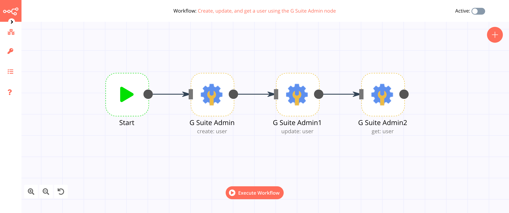
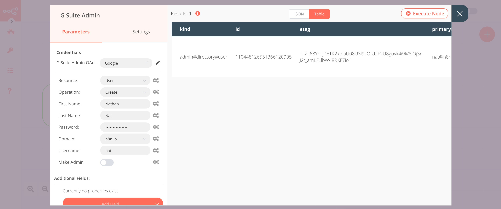
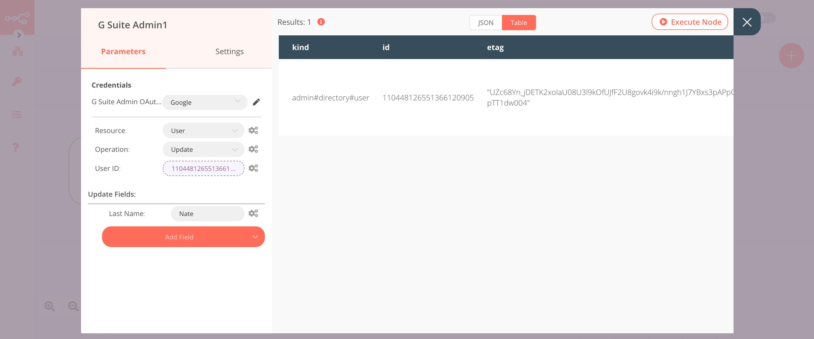

# G Suite Admin

[G Suite Admin](https://developers.google.com/admin-sdk) helps you administer domain and app resources, create reports, and manage subscriptions and alerts for your G Suite organization.

::: tip 🔑 Credentials
You can find authentication information for this node [here](../../../credentials/Google/README.md).
:::

## Basic Operations

::: details User
- Create a user
- Delete a user
- Get a user
- Get all users
- Update a user
:::

## Example Usage

This workflow allows you to create, update, and get a user using the G Suite Admin node. You can also find the [workflow](https://n8n.io/workflows/710) on n8n.io. This example usage workflow uses the following nodes.
- [Start](../../core-nodes/Start/README.md)
- [G Suite Admin]()

The final workflow should look like the following image.

### 1. Start node

The Start node exists by default when you create a new workflow.
  
### 2. G Suite Admin node (create: user)

This node will create a user in G Suite with the following information:  first name, last name, password, domain, and username.

1. First of all, you'll have to enter credentials for the G Suite Admin node. You can find out how to do that [here](../../../credentials/Google/README.md).
3. Enter the first name of the user in the ***First Name*** field.
4. Enter the last name of the user in the ***Last Name*** field.
5. Enter a password for the user in the ***Password*** field.
6. Select the domain from the ***Domain*** dropdown list.
7. Enter the username for the user in the ***Username*** field.
8. Click on ***Execute Node*** to run the workflow.

In the screenshot below, you will observe that the node has created a new user with the first name `Nathan`, last name `Nat`, domain `n8n.io`, username `nat`, and a password, in G Suite.

::: v-pre
### 3. G Suite Admin1 node (update: user)

This node will get the User ID from the previous node and update the user's last name to `Nate`.

1. Select the credentials that you entered in the previous G Suite Admin node.
2. Select 'Update' from the ***Operation*** dropdown list.
3. Click on the gears icon next to the ***User ID*** field and click on ***Add Expression***.
4. Select the following in the ***Variable Selector*** section: Nodes > G Suite Admin > Output Data > JSON > id. You can also add the following expression: `{{$node["G Suite Admin"].json["id"]}}`.
5. Click on the ***Add Field*** button and select 'Last Name' from the dropdown list.
6. Enter the last name in the ***Last Name*** field.
7. Click on ***Execute Node*** to run the workflow.
:::

In the screenshot below, you will notice that the node has updated the last name of the user that we created in the previous node. 

::: v-pre
### 4. G Suite Admin2 (get: user)

This node will get the information of the user we created in the G Suite Admin node.

1. Select the credentials that you entered in the previous G Suite Admin node.
2. Select 'Get' from the ***Operation*** dropdown list.
3. Click on the gears icon next to the ***User ID*** field and click on ***Add Expression***.
4. Select the following in the ***Variable Selector*** section: Nodes > G Suite Admin > Output Data > JSON > id. You can also add the following expression: `{{$node["G Suite Admin"].json["id"]}}`.
5. Click on ***Execute Node*** to run the workflow.
:::

In the screenshot below, you will notice that the node returns the information of the user we created in the G Suite Admin node. 

## FAQs

### What are the different ways to project a user's information?

There are three different ways to project a user's information:
- ***Basic:*** Does not include any custom fields.
- ***Custom:*** Includes the custom fields from schemas in customField.
- ***Full:*** Include all the fields associated with the user.

You can include custom fields by following the steps mentioned below.
1. Select 'Custom' from the ***Projection*** dropdown list.
2. Click on the ***Add Options*** button and select 'Custom Schemas' from the dropdown list.
3. Select the schema names you want to include from the ***Custom Schemas*** dropdown list.
