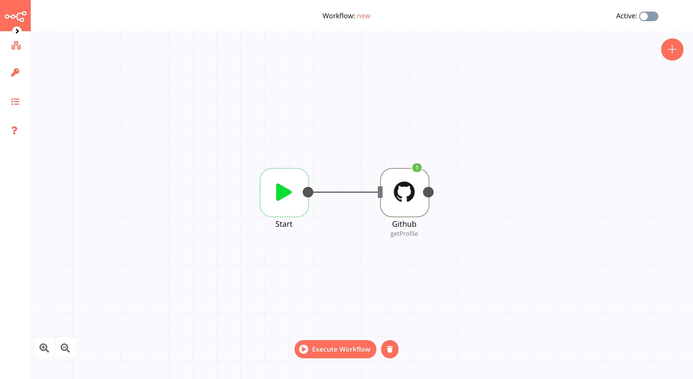

# GitHub

[GitHub](https://github.com/) provides hosting for software development and version control using Git. It offers the distributed version control and source code management (SCM) functionality of Git, access control and several collaboration features such as bug tracking, feature requests, task management, and wikis for every project.

::: tip 🔑 Credentials
You can find authentication information for this node [here](../../../credentials/Github/README.md).
:::

## Basic Operations

<Resource node="GitHub" />

## Example Usage

This workflow allows you to get the community profile of a GitHub repository. You can also find the [workflow](https://n8n.io/workflows/450) on the website. This example usage workflow uses the following two nodes.
- [Start](../../core-nodes/Start/README.md)
- [GitHub]()

The final workflow should look like the following image.

### 1. Start node

The start node exists by default when you create a new workflow.

### 2. GitHub node

1. First of all, you'll have to enter credentials for the GitHub node. You can find out how to do that [here](../../../credentials/Github/README.md).
2. Select the 'Repository' option under the *Resource* field.
3. Select the 'Get Profile' option under the *Operation* field.
4. Enter the repository owner in the *Repository Owner* field.
5. Enter the repository name in the *Repository Name* field.
6. Click on *Execute Node* to run the workflow.
