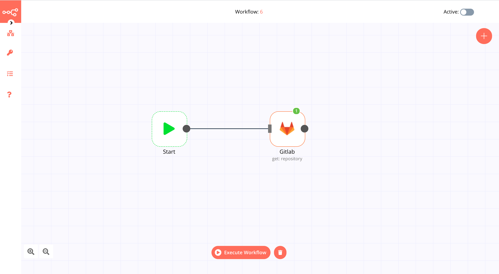

# GitLab

[GitLab](https://gitlab.com/) is a web-based DevOps lifecycle tool that provides a Git-repository manager providing wiki, issue-tracking, and continuous integration/continuous deployment pipeline features.

::: tip 🔑 Credentials
You can find authentication information for this node [here](../../../credentials/Gitlab/README.md).
:::

## Basic Operations

<Resource node="GitLab" />

## Example Usage

This workflow allows you to get the details of a GitLab repository. You can also find the [workflow](https://n8n.io/workflows/465) on the website. This example usage workflow uses the following two nodes.
- [Start](../../core-nodes/Start/README.md)
- [GitLab]()

The final workflow should look like the following image.

### 1. Start node

The start node exists by default when you create a new workflow.

### 2. GitLab node

1. First of all, you'll have to enter credentials for the GitLab node. You can find out how to do that [here](../../../credentials/Gitlab/README.md).
2. Select the 'Repository' option from the *Resource* dropdown list.
3. Select the 'Get' option under the *Operation* field.
4. Enter the project owner in the *Project Owner* field.
5. Enter the project name in the *Project Name* field.
6. Click on *Execute Node* to run the workflow.
