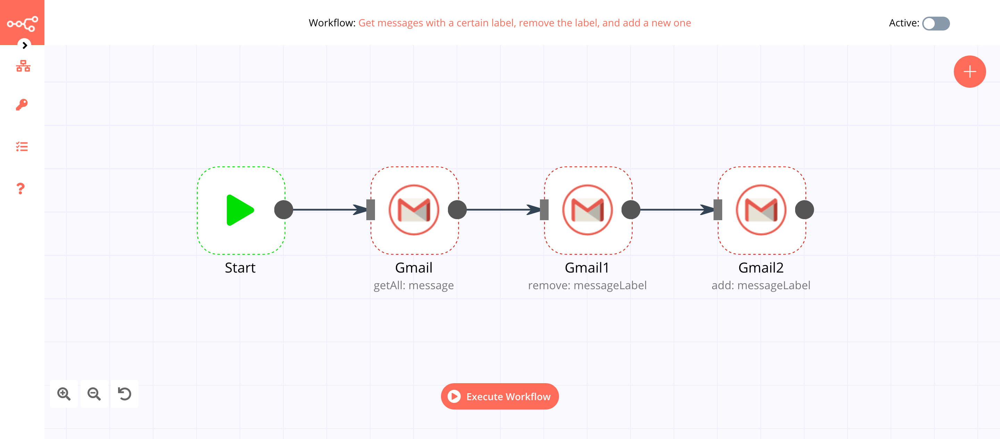
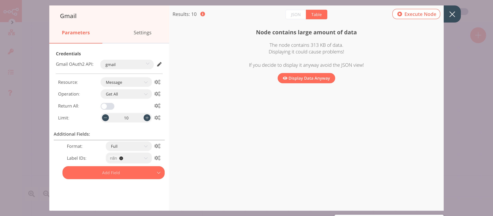
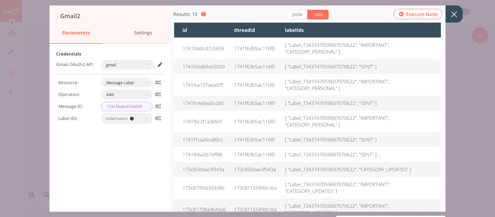

# Gmail

[Gmail](https://www.gmail.com) is an email service developed by Google. Users can access Gmail on the web and using third-party programs that synchronize email content through POP or IMAP protocols.

::: tip 🔑 Credentials
You can find authentication information for this node [here](../../../credentials/Google/README.md).
:::

## Basic Operations

::: details Draft
- Create a new email draft
- Delete a draft
- Get a draft
- Get all drafts
:::

::: details Label
- Create a new label
- Delete a label
- Get a label
- Get all labels
:::

::: details Message
- Send an email
- Delete a message
- Get a message
- Get all messages
- Reply to an email
:::

::: details Message Label
- Add a label to a message
- Remove a label from a message
:::

## Example Usage

This workflow allows you to get all messages with a certain label, remove the label from the messages, and add a new label to the messages. You can also find the [workflow](https://n8n.io/workflows/621) on n8n.io. This example usage workflow would use the following nodes.
- [Start](../../core-nodes/Start/README.md)
- [Gmail]()

The final workflow should look like the following image.

### 1. Start node

The start node exists by default when you create a new workflow.

### 2. Gmail node (getAll: message)

1. First of all, you'll have to enter credentials for the Gmail node. You can find out how to do that [here](../../../credentials/Google/README.md).
2. Select 'Message' from the ***Resource*** dropdown list.
3. Select 'Get All' from the ***Operation*** dropdown list.
4. Click on ***Add Field*** button and select 'Format' from the dropdown list.
5. Select 'Full' from ***Format*** dropdown menu.
6. Click on ***Add Field*** button and select 'Label IDs' from the dropdown list.
7. Select the label from ***Label IDs*** dropdown list.
8. Click on ***Execute Node*** to run the node.

::: v-pre
### 3. Gmail1 node (remove: messageLabel)

1. Select the credentials that you entered in the previous Gmail node.
2. Select 'Message Label' from the ***Resource*** dropdown list.
3. Select 'Remove' from the ***Operation*** dropdown list.
4. Click on the gears icon next to the ***Message ID*** field and click on ***Add Expression***.
5. Select the following in the ***Variable Selector*** section: Nodes > Gmail > Output Data > JSON > id. You can also add the following expression: `{{$node["Gmail"].json["id"]}}`.
6. Select the label from ***Label IDs*** dropdown list.
7. Click on ***Execute Node*** to run the node.
:::

::: v-pre
### 4. Gmail2 node (add: messageLabel)

1. Select the credentials that you entered in the previous Gmail node.
2. Select 'Message Label' from the ***Resource*** dropdown list.
3. Click on the gears icon next to the ***Message ID*** field and click on ***Add Expression***.
4. Select the following in the ***Variable Selector*** section: Nodes > Gmail > Output Data > JSON > id. You can also add the following expression: `{{$node["Gmail"].json["id"]}}`.
5. Select the label from ***Label IDs*** dropdown list.
6. Click on ***Execute Node*** to run the node.
:::

## Further Reading

- [Supercharging your conference registration process with n8n 🎫](https://medium.com/n8n-io/supercharging-your-conference-registration-process-with-n8n-2831cdff37f9)