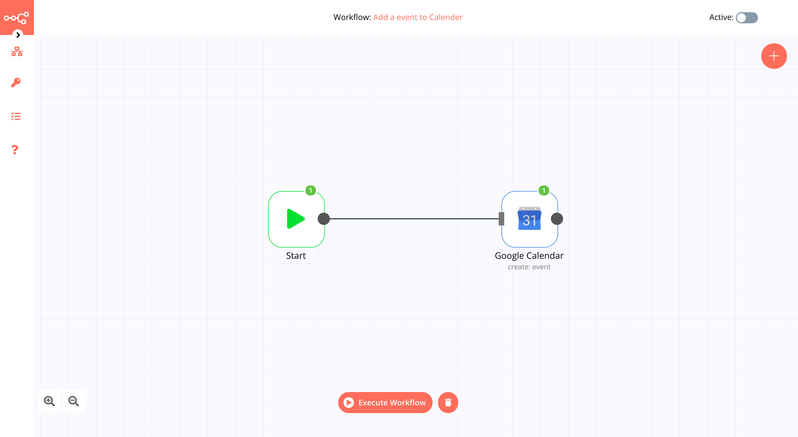

# Google Calendar

[Google Calendar](https://www.google.com/calendar/) is a time-management and scheduling calendar service developed by Google.

::: tip 🔑 Credentials
You can find authentication information for this node [here](../../../credentials/Google/README.md).
:::

## Basic Operations

- Event
    - Add a event to calendar
    - Delete an event
    - Retrieve an event
    - Retrieve all events from a calendar
    - Update an event

## Example Usage

This workflow allows you to add an event to Google Calendar. You can also find the [workflow](https://n8n.io/workflows/427) on the website. This example usage workflow uses the following two nodes.
- [Start](../../core-nodes/Start/README.md)
- [Google Calendar]()

The final workflow should look like the following image.

### 1. Start node

The start node exists by default when you create a new workflow.

### 2. Google Calendar node

1. First of all, you'll have to enter credentials for the Google Calendar node. You can find out how to do that [here](../../../credentials/Google/README.md).
2. Select the *Calendar* from the dropdown list of the user's calendar list.
3. Enter the start date of your event in the *Start* field.
4. Enter the end date of your event in the *End* field.
5. Click on *Execute Node* to run the workflow.

## Further Reading

- [Tracking Time Spent in Meetings With Google Calendar, Twilio, and n8n 🗓](https://medium.com/n8n-io/tracking-time-spent-in-meetings-with-google-calendar-twilio-and-n8n-a5d00f77da8c)
