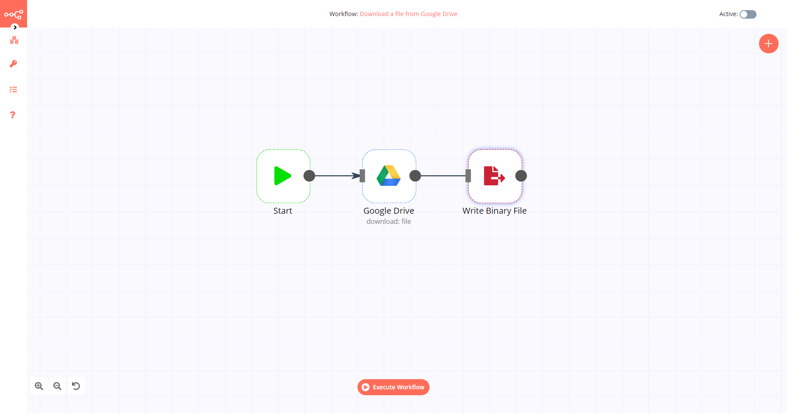

# Google Drive

[Google Drive](https://drive.google.com) is a file storage and synchronization service developed by Google. It allows users to store files on their servers, synchronize files across devices, and share files.

::: tip 🔑 Credentials
You can find authentication information for this node [here](../../../credentials/Google/README.md).
:::

## Basic Operations

<Resource node="Google Drive" />

## Example Usage

This workflow allows you to download a file from Google Drive. You can also find the [workflow](https://n8n.io/workflows/515) on the website. This example usage workflow uses the following two nodes.
- [Start](../../core-nodes/Start/README.md)
- [Google Drive]()
- [Write Binary File](../../core-nodes/WriteBinaryFile/README.md)

The final workflow should look like the following image.

### 1. Start node

The Start node exists by default when you create a new workflow.

### 2. Google Sheets node

1. First of all, you'll have to enter credentials for the Google Drive node. You can find out how to do that [here](../../../credentials/Google/README.md), in the section 'Google Drive / Sheets API'.
2. Select the authentication method you plan to use from the *Authentication* dropdown list.
3. Select 'Download' from the *Operation* dropdown list.
4. Copy the string of characters located between `/d/` and `/edit` in your Google Drive URL. Paste that string in the *File ID* field.

### 3. Write Binary File node

1. Enter the destination file path in the *File Name* field.
2. Click on *Execute Node* to run the workflow.

## FAQs

### How do I list all files/folders within a folder?

To list all the files and folders within a folder, follow the steps mentioned below.

1. Toggle ***Use Query String*** to `true`.
2. Copy the string of characters located after `https://drive.google.com/drive/u/0/folders/`. This string is the folder ID.
3. Enter `'FOLDER_ID' in parents` in the ***Query String*** field. Replace `FOLDER_ID` with the folder ID you copied in the previous step.

There are several additional options available to fine grain the listed results. Refer to [Search for files and folders: Querystring](https://developers.google.com/drive/api/v3/search-files#query_string_examples) for more information.
