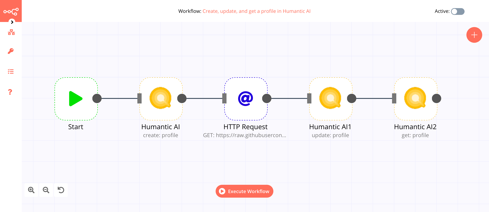
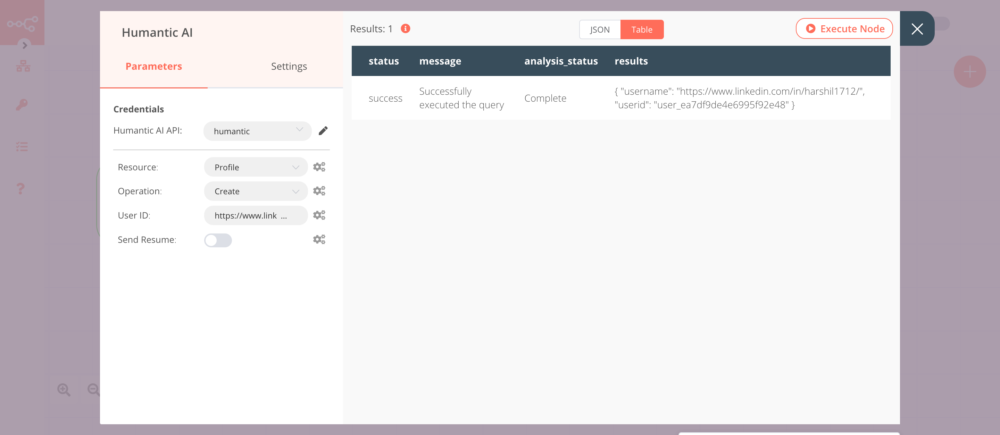
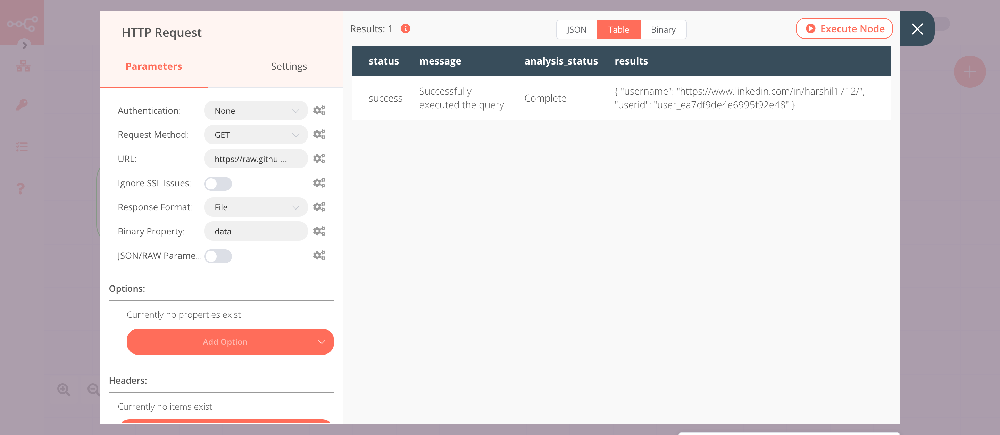
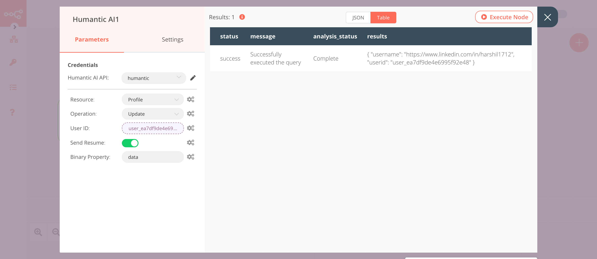
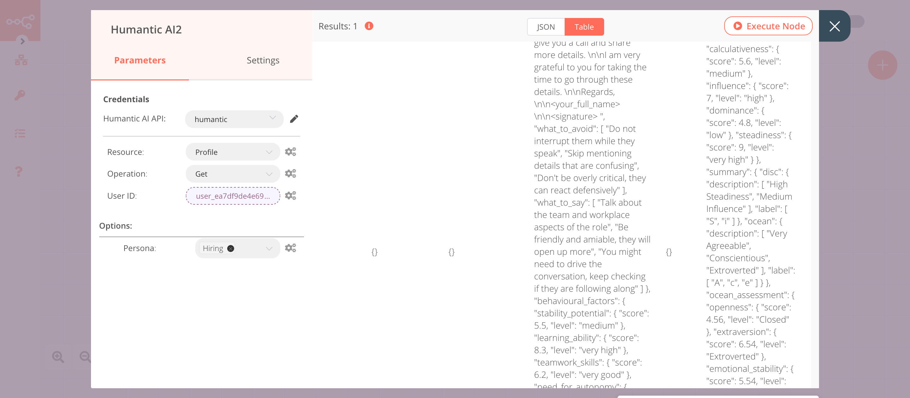

# Humantic AI

[Humantic AI](https://humantic.ai/) provides AI-driven behavior and personality assessment of a candidate.

::: tip 🔑 Credentials
You can find authentication information for this node [here](../../../credentials/HumanticAi/README.md).
:::

## Basic Operations

<Resource node="n8n-nodes-base.humanticAi" />

## Example Usage

This workflow allows you to create, update, and get a profile using the Humantic AI node. You can also find the [workflow](https://n8n.io/workflows/784) on n8n.io. This example usage workflow uses the following nodes.
- [Start](../../core-nodes/Start/README.md)
- [HTTP Request](../../core-nodes/HTTPRequest/README.md)
- [Humantic AI]()

The final workflow should look like the following image.

### 1. Start node

The Start node exists by default when you create a new workflow.

### 2. Humantic AI node (create: profile)

This node will create a new profile for a candidate in Humantic AI. We will create a new profile using the LinkedIn URL of a candidate.

1. First of all, you'll have to enter credentials for the Humantic AI node. You can find out how to do that [here](../../../credentials/HumanticAi/README.md).
2. Enter the LinkedIn URL of the candidate in the ***User ID*** field.
3. Click on ***Execute Node*** to run the node.

In the screenshot below, you will notice that the node creates a new profile using the LinkedIn URL of the candidate.

### 3. HTTP Request node (GET)

This node will fetch the resume of the candidate from a URL that we specify. We will pass on this resume to the next node in the workflow.

1. Enter the URL of the candidate's resume in the ***URL*** field.
2. Select 'File' from the ***Response Format*** dropdown list.
3. Click on ***Execute Node*** to run the node.

In the screenshot below, you will notice that the node fetches the resume of the candidate from the URL we specified.

### 4. Humantic AI1 node (update: profile)

This node will update the information of the candidate that we created using the Humantic AI node. We will add the candidate's resume that we fetched in the previous node.

::: v-pre
1. Select the credentials that you entered in the previous Humantic AI node.
2. Select 'Update' from the ***Operation*** dropdown list.
3. Click on the gears icon next to the ***User ID*** field and click on ***Add Expression***.
4. Select the following in the ***Variable Selector*** section: Nodes > Humantic AI > Output Data > JSON > results > userid. You can also add the following expression: `{{$node["Humantic AI"].json["results"]["userid"]}}`.
5. Toggle ***Send Resume*** to `true`.
6. Click on ***Execute Node*** to run the node.
:::

In the screenshot below, you will notice that the node updates the information of the candidate that we created using the Humantic AI node. Here, the node has added the resume of the candidate.

### 5. Humantic AI2 node (get: profile)

This node will return the `Hiring` persona for the candidate that we created using the Humantic AI node.
::: v-pre
1. Select the credentials that you entered in the previous node.
2. Click on the gears icon next to the ***User ID*** field and click on ***Add Expression***.
3. Select the following in the ***Variable Selector*** section: Nodes > Humantic AI > Output Data > JSON > results > userid. You can also add the following expression: `{{$node["Humantic AI"].json["results"]["userid"]}}`.
4. Click on the ***Add Option*** button.
5. Select 'Hiring' from the ***Persona*** dropdown list.
6. Click on ***Execute Node*** to run the node.
:::
In the screenshot below, you will notice that the node returns the `Hiring` persona for the candidate that we created using the Humantic AI node (column headers are not visible in the screenshot since we've scrolled down to show the data).

