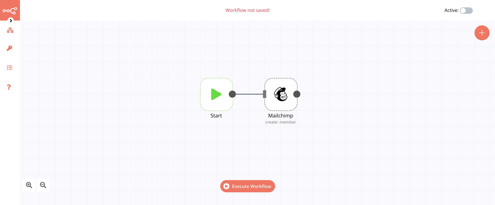

# Mailchimp

[Mailchimp](https://mailchimp.com/) is an integrated marketing platform that allows business owners to automate their email campaigns and track user engagement.

::: tip 🔑 Credentials
The instructions for authenticating with Mailchimp are [here](../../../credentials/MailChimp/README.md).
:::

## Basic Operations

- Member
	- Create a new member on the list
	- Delete a member on the list
	- Get a member on the list
	- Get all members on a list
	- Update a new member on the list
- Member Tag
	- Add tags from a list member
	- Remove tags from a list member

## Example Usage

This workflow demonstrates creating a new member for a list. You can also find the [workflow](https://n8n.io/workflows/413) on this website. This example usage workflow uses the following two nodes.

- [Start](../../core-nodes/Start)
- [Mailchimp]()

The final workflow should look like the following image.

### 1. Start node

The start node exists by default when you create a new workflow.

### 2. Mailchimp Node

1. First of all, you'll have to enter credentials for the Twilio node. You can find out how to do that [here](../../../credentials/MailChimp/README.md).
2. To create a member, select the Member option under the *Resource* field.
3. Select the Create option in the *Operation* field.
4. Choose the list you want to add to under the *List* field.
5. Enter the email address of the user to the *Email* field.
6. Choose their status in the *Status* field.
7. If you want to enter optional fields such as the user's lat/long location or their Name and Birthday as JSON data, then select the JSON parameters. Otherwise, optionally enter in this data through the dropdowns below.
8. Click on *Execute Node* to run the workflow.
