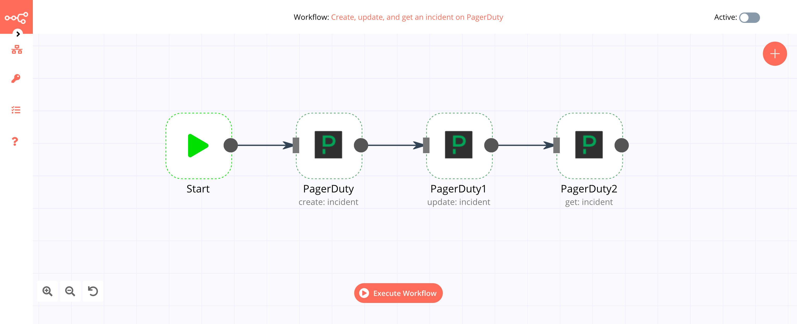
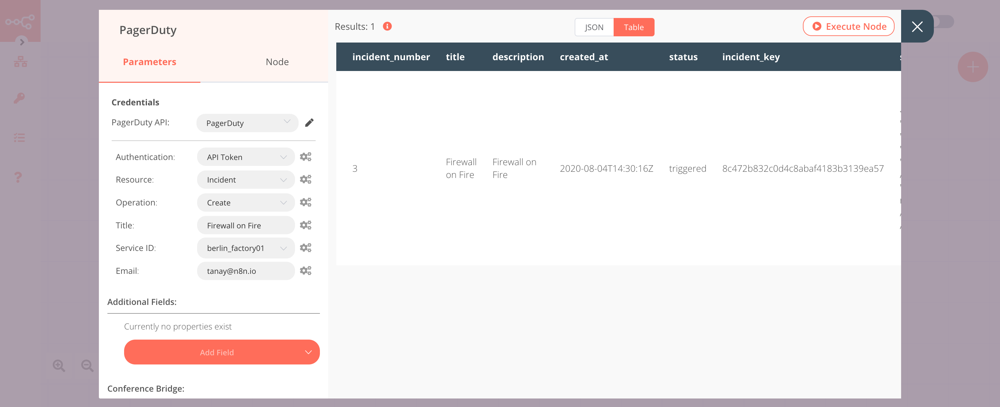
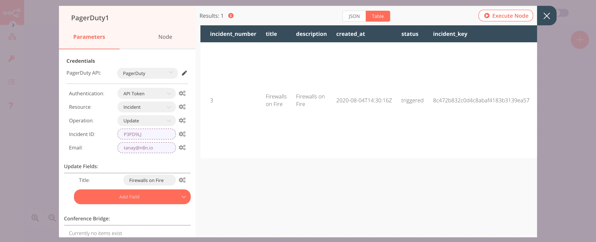
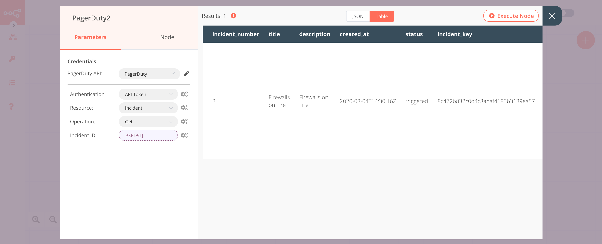

# PagerDuty

[PagerDuty](https://www.pagerduty.com/) is a cloud computing company that produces a SaaS incident response platform for IT departments.

::: tip 🔑 Credentials
You can find authentication information for this node [here](../../../credentials/PagerDuty/README.md).
:::

## Basic Operations

- Incident
    - Create an incident
    - Get an incident
    - Get all incidents
    - Update an incident
- Incident Note
    - Create an incident note
    - Get all incident's notes
- Log Entry
    - Get a log entry
    - Get all log entries
- User
    - Get a user

## Example Usage

This workflow allows you to create, update, and get an incident on PagerDuty. You can also find the [workflow](https://n8n.io/workflows/411) on n8n.io. This example usage workflow would use the following two nodes.
- [Start](../../core-nodes/Start/README.md)
- [PagerDuty]()

The final workflow should look like the following image.

### 1. Start node

The start node exists by default when you create a new workflow.

### 2. PagerDuty node (create: incident)

1. First of all, you'll have to enter credentials for the PagerDuty node. You can find out how to do that [here](../../../credentials/PagerDuty/README.md).
2. Enter the title of the incident in the ***Title*** field.
3. Select the ***Service ID*** from the dropdown list.
4. Enter your email in the ***Email*** field.
5. Click on ***Execute Node*** to run the node.

::: v-pre
### 3. PagerDuty1 node (update: incident)

1. Select the credentials that you entered in the previous node.
2. Select 'Update' from the ***Operation*** dropdown list.
3. Click on the gears icon next to the ***Incident ID*** field and click on ***Add Expression***.
4. Select the following in the ***Variable Selector*** section: Nodes > PagerDuty > Output Data > JSON > id. You can also add the following expression: `{{$node["PagerDuty"].json["id"]}}`.
5. Click on the gears icon next to the ***Email*** field and click on ***Add Expression***.
6. Select the following in the ***Variable Selector*** section: Nodes > PagerDuty > Parameters > email. You can also add the following expression: `{{$node["PagerDuty"].parameter["email"]}}`.
7. Click on the ***Add Field*** button and click on ***Title***.
8. Enter the name of the updated title in the ***Title*** field.
9. Click on ***Execute Node*** to run the node.
:::

::: v-pre
### 4. PagerDuty2 node (get: incident)

1. Select the credentials that you entered in the previous node.
2. Select 'Get' from the ***Operation*** dropdown list.
3. Click on the gears icon next to the ***Incident ID*** field and click on ***Add Expression***.
4. Select the following in the ***Variable Selector*** section: Nodes > PagerDuty > Output Data > JSON > id. You can also add the following expression: `{{$node["PagerDuty"].json["id"]}}`.
5. Click on ***Execute Node*** to run the node.
:::

## Further Reading

- [Creating Custom Incident Response Workflows with n8n 🚨](https://medium.com/n8n-io/creating-custom-incident-response-workflows-with-n8n-9baef0bbedb9)
