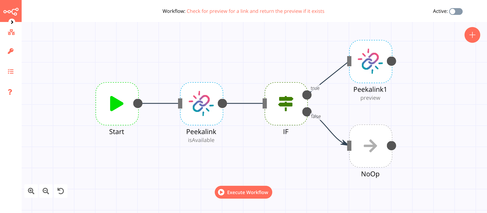
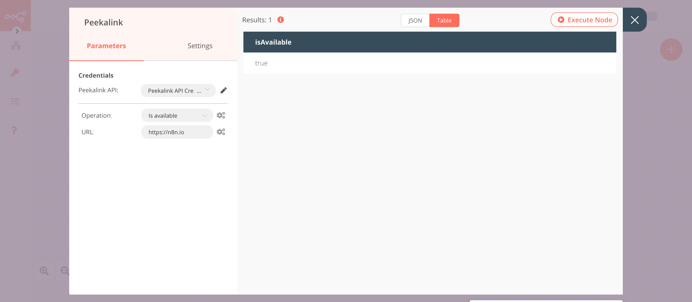
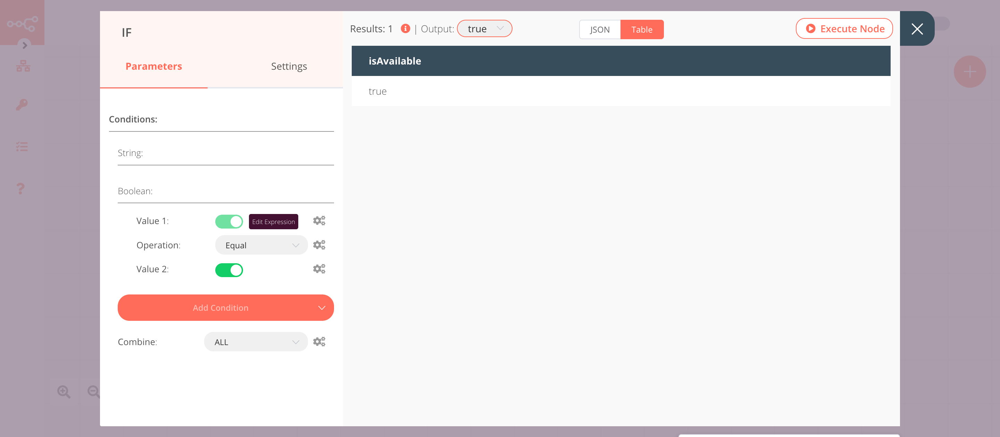
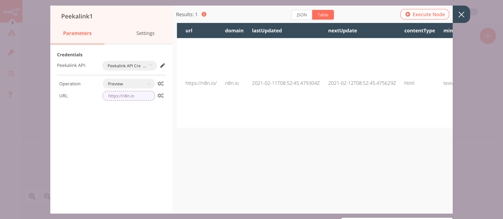
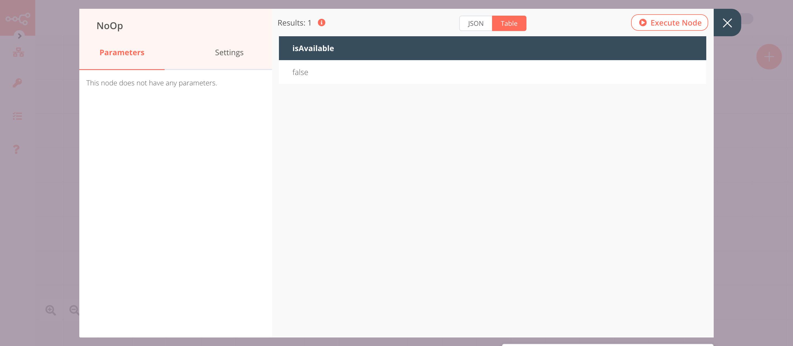

# Peekalink

[Peekalink](https://peekalink.io) is an API that allows developers to preview links on the web.

::: tip 🔑 Credentials
You can find authentication information for this node [here](../../../credentials/Peekalink/README.md).
:::

## Basic Operations

- Check whether a preview for a given link is available
- Return the preview for a link

## Example Usage

This workflow allows you to check if preview for a link is available and return the link preview. You can also find the [workflow](https://n8n.io/workflows/935) on n8n.io. This example usage workflow uses the following nodes.
- [Start](../../core-nodes/Start/README.md)
- [Peekalink]()
- [IF](../../core-nodes/IF/README.md)
- [No Operation, do nothing](../../core-nodes/NoOperationDoNothing/README.md)

The final workflow should look like the following image.

### 1. Start node

The Start node exists by default when you create a new workflow.

### 2. Peekalink node (create: room)

This node will check whether a preview for the specified link is available.

1. First of all, you'll have to enter credentials for the Peekalink node. You can find out how to do that [here](../../../credentials/Peekalink/README.md).
2. Select 'Is available' from the ***Operation*** dropdown list.
3. Enter a URL in the ***URL*** field.
4. Click on ***Execute Node*** to run the node.

In the screenshot below, you will notice that the node returns information about whether a preview for the specified link is available.

### 3. IF node

This node will check the response from the previous node. If the previous node returned `true`, the IF node will also return `true`, otherwise the IF node will return `false`.

::: v-pre
1. Click on ***Add Condition*** and select 'Boolean'.
2. Click on the gears icon next to the ***Value 1*** field and click on ***Add Expression***.
3. Select the following in the ***Variable Selector*** section: Current Node > Input Data > JSON > isAvailable. You can also add the following expression: `{{$json["isAvailable"]}}`.
4. Toggle ***Value 2*** to `true`.
5. Click on ***Execute Node*** to run the node.
:::

In the screenshot below, you will notice that the node returns the data from the previous node for the `true` branch.

### 4. Peekalink node (preview)

This node will return the preview of the URL that you specified in the Peekalink node.

::: v-pre
1. Connect the node to the 'true' output of the IF node
2. Select the credentials that you entered in the previous Peekalink node.
3. Click on the gears icon next to the ***URL*** field and click on ***Add Expression***.
4. Select the following in the ***Variable Selector*** section: Nodes > Peekalink > Parameters > url. You can also add the following expression: `{{$node["Peekalink"].parameter["url"]}}`.
5. Click on ***Execute Node*** to run the node.
:::

In the screenshot below, you will notice that the node returns the preview of the URL that you specified in the Peekalink node.

### 5. NoOp node
Adding this node here is optional, as the absence of this node won't make a difference to the functioning of the workflow. We've added this as it can sometimes help others with a better understanding of the workflow, visually.

::: v-pre
1. Create a ***NoOp*** node connected to the 'false' output of the IF node.
2. Click on ***Execute Node*** to run the node.
:::

