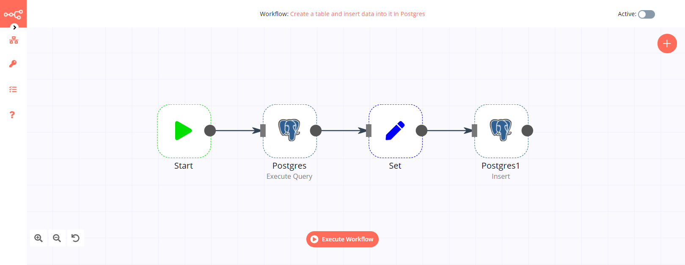
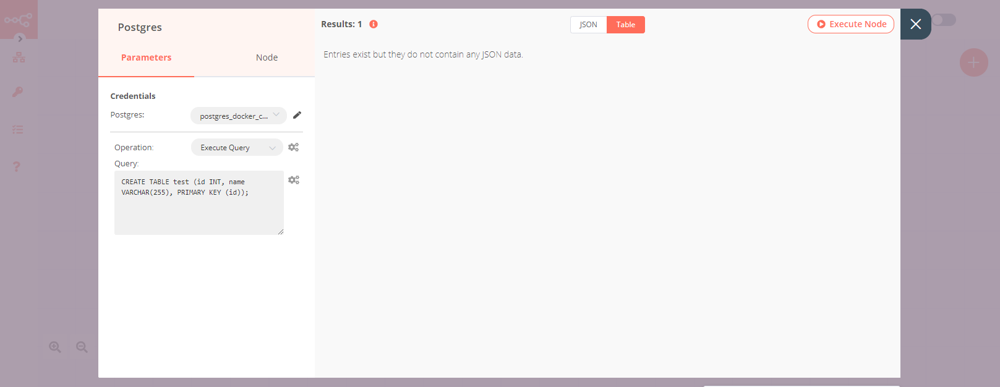
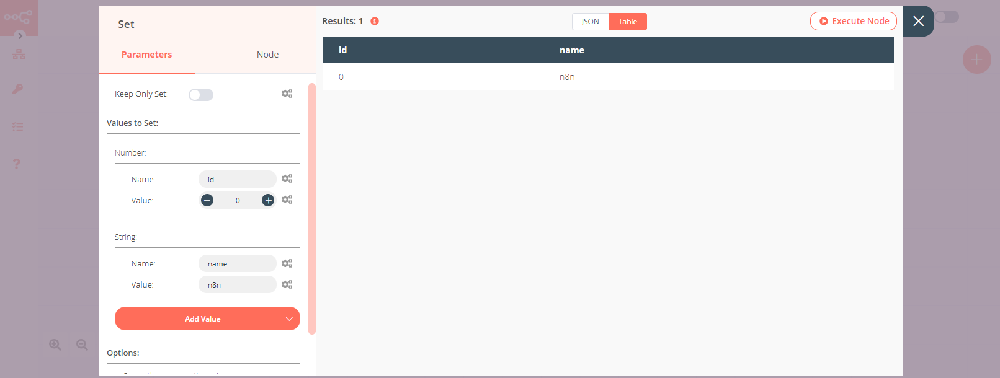
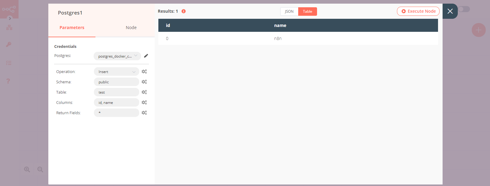

# Postgres

[PostgreSQL](https://www.postgresql.org/), also known as Postgres, is a free and open-source relational database management system emphasizing extensibility and SQL compliance.

::: tip 🔑 Credentials
You can find authentication information for this node [here](../../../credentials/Postgres/README.md).
:::

## Basic Operations

- Execute an SQL query
- Insert rows in database
- Update rows in database

## Example Usage

This workflow allows you to run an SQL query on a Postgres instance. You can also find the [workflow](https://n8n.io/workflows/599) on n8n.io. This example usage workflow would use the following nodes.
- [Start](../../core-nodes/Start/README.md)
- [Set](../../core-nodes/Set/README.md)
- [Postgres]()

The final workflow should look like the following image.

### 1. Start node

The start node exists by default when you create a new workflow.

### 2. Postgres node (Execute Query)

1. First of all, you'll have to enter credentials for the Postgres node. You can find out how to do that [here](../../../credentials/Postgres/README.md).
2. Select 'Execute Query' from the ***Operation*** dropdown list.
3. Enter the following SQL query in the ***Query*** field: `CREATE TABLE test (id INT, name VARCHAR(255), PRIMARY KEY (id));`.
4. Click on the ***Node*** tab and toggle ***Always Output Data*** to true.
5. Click on ***Execute Node*** to run the node.

### 3. Set node

1. Click on the ***Add Value*** button and select 'Number' from the dropdown list.
2. Enter `id` in the ***Name*** field.
3. Click on the ***Add Value*** button and select 'String' from the dropdown list.
4. Enter `name` in the ***Name*** field.
5. Enter the value for the name in the ***Value*** field.
6. Click on ***Execute Node*** to run the node.

### 4. Postgres1 node (Insert)

1. Select the credentials that you entered in the previous Postgres node.
2. Enter `test` in the ***Table*** field.
3. Enter `id, name` in the ***Columns*** field.
4. Click on ***Execute Node*** to run the node.

## Further Reading

<FurtherReadingBlog node="Postgres" />
