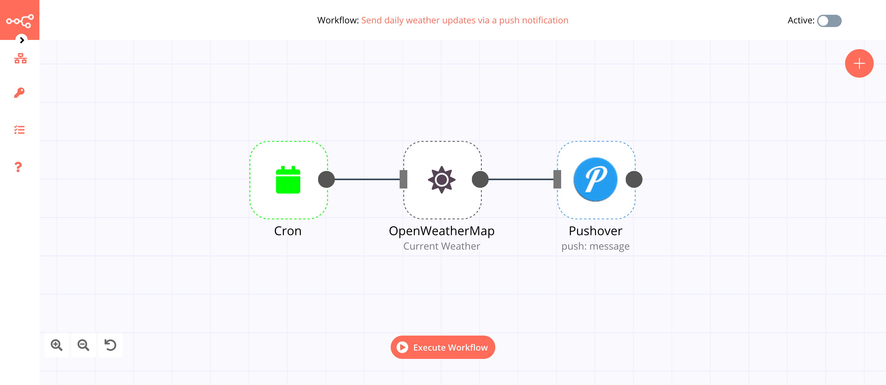
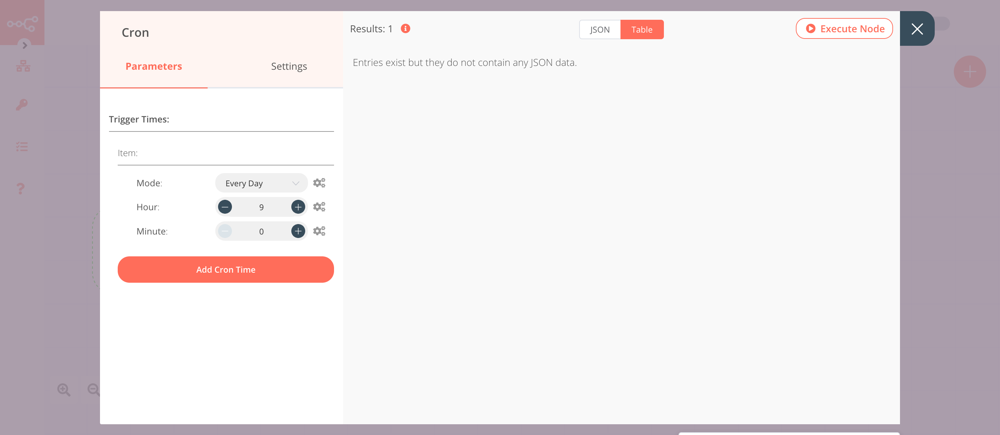
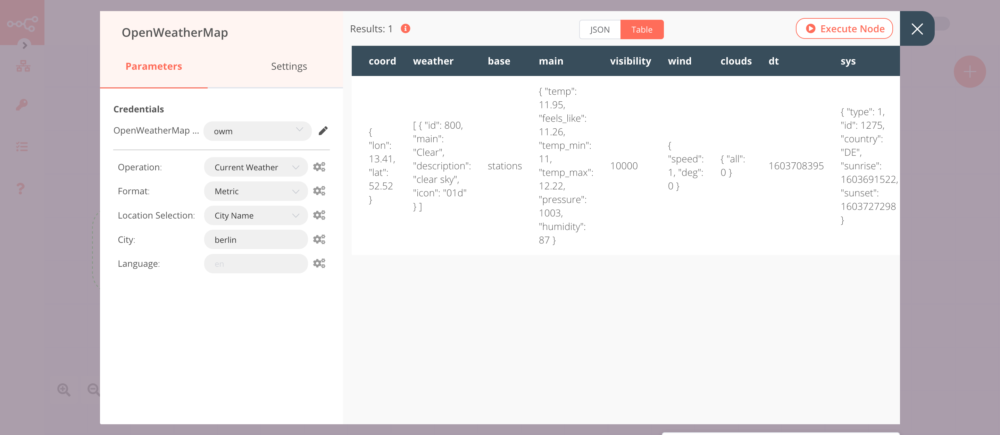
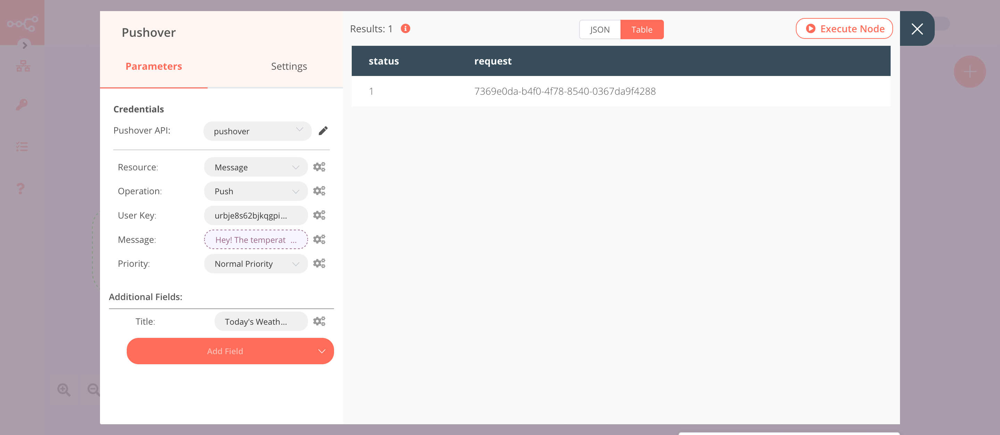

# Pushover

[Pushover](https://www.pushover.net/) is a simple push notification service that integrates easily into web apps, network monitors, shell scripts, servers, and anything else that needs to send alerts to your Android, iPhone, iPad, and Desktop.

::: tip 🔑 Credentials
You can find authentication information for this node [here](../../../credentials/Pushover/README.md).
:::

## Basic Operations

::: details Message
- Push
:::

## Example Usage

This workflow allows you to send daily weather updates via a push notification using the Pushover node. You can also find the [workflow](https://n8n.io/workflows/740) on n8n.io. This example usage workflow uses the following nodes.
- [Cron](../../core-nodes/Cron/README.md)
- [OpenWeatherMap](../../nodes/OpenWeatherMap/README.md)
- [Pushover]()

The final workflow should look like the following image.

### 1. Cron node

The Cron node will trigger the workflow daily at 9 AM.

1. Click on ***Add Cron Time***.
2. Set hours to 9 in the ***Hour*** field.
3. Click on ***Execute Node*** to run the node.

In the screenshot below, you will notice that the Cron node is configured to trigger the workflow every day at 9 AM.

### 2. OpenWeatherMap node (Current Weather)

This node will return data about the current weather in Berlin. To get the weather updates for your city, you can enter the name of your city instead.

1. First of all, you'll have to enter credentials for the OpenWeatherMap node. You can find out how to do that [here](../../../credentials/OpenWeatherMap/README.md). 
2. Enter `berlin` in the ***City*** field.
3. Click on ***Execute Node*** to run the node.

In the screenshot below, you will notice that the node returns data about the current weather in Berlin.

### 3. Pushover node (push: message)

This node will send a notification with the weather update, which was sent by the previous node.

1. First of all, you'll have to enter credentials for the Pushover node. You can find out how to do that [here](../../../credentials/Pushover/README.md).
2. Enter a user key in the ***User Key*** field. You can find your user key from the [Pushover Dashboard](https://www.pushover.net/).
3. Click on the gears icon next to the ***Message*** field and click on ***Add Expression***.
::: v-pre
5. Enter the following message in the ***Expression*** field: `Hey! The temperature outside is {{$node["OpenWeatherMap"].json["main"]["temp"]}}°C.`.
6. Select 'Normal Priority' from the ***Priority*** dropdown list. This will trigger sound, vibration, and display an alert according to the user's device settings.
7. Click on ***Add Field*** and select 'Title' from the dropdown list.
8. Enter `Today's Weather` in the ***Title*** field.
9. Click on ***Execute Node*** to run the node.
:::

In the screenshot below, you will notice that the node sends a notification to a device with the weather update, which was sent by the previous node.

