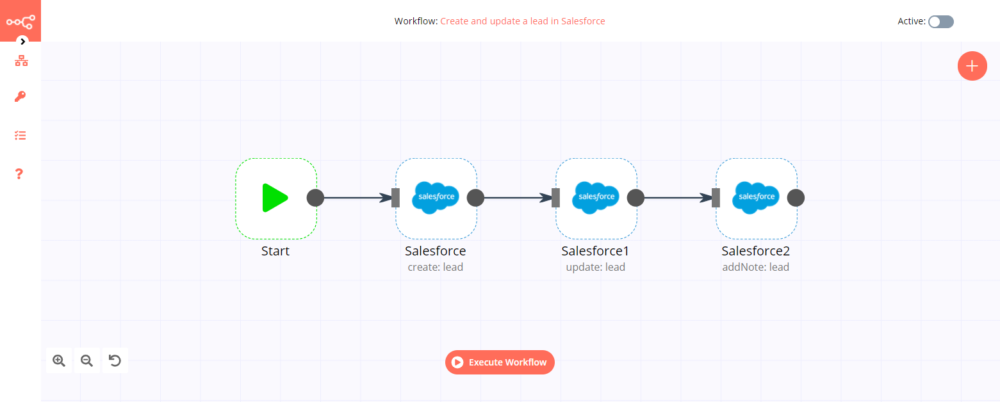
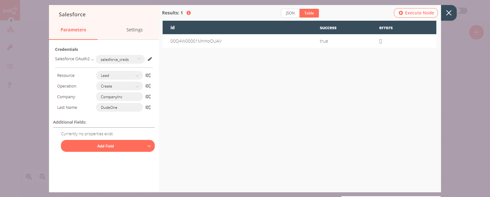
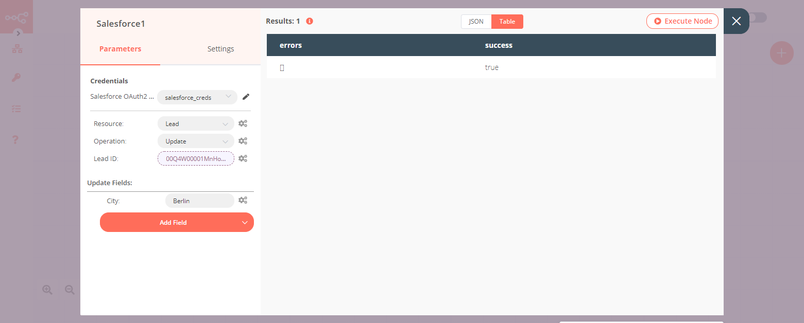
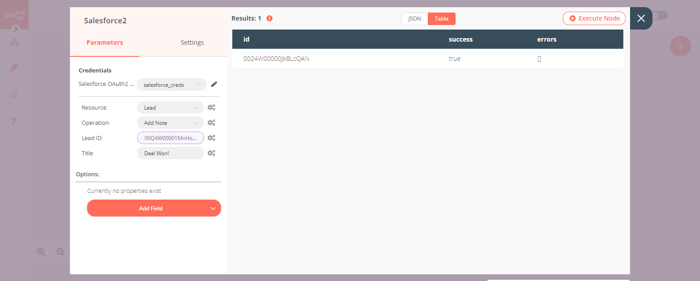

# Salesforce

[Salesforce](https://www.salesforce.com/) is a cloud-based software company. It provides customer relationship management service and also sells a complementary suite of enterprise applications focused on customer service, marketing automation, analytics, and application development.

::: tip 🔑 Credentials
You can find authentication information for this node [here](../../../credentials/Salesforce/README.md).
:::

## Basic Operations

- Account
    - Add note to an account
    - Create an account
    - Get an account
    - Get all accounts
    - Get an overview of accounts
    - Delete an account
    - Update an account
- Attachment
    - Create an attachment
    - Delete an attachment
    - Get an attachment
    - Get all attachments
    - Get an overview of attachments metadata
    - Update an attachment
- Case
    - Add a comment to a case
    - Create a case
    - Get a case
    - Get all cases
    - Get an overview of cases metadata
    - Delete a case
    - Update a case
- Contact
    - Add lead to a campaign
    - Add note to a contact
    - Create a contact
    - Delete a contact
    - Get a contact
    - Get overview of contacts metadata
    - Get all contacts
    - Update a contact
- Lead
    - Add lead to a campaign
    - Add note to a lead
    - Create a lead
    - Delete a lead
    - Get a lead
    - Get all leads
    - Get summary of leads metadata
    - Update a lead
- Opportunity
    - Add note to an opportunity
    - Create an opportunity
    - Delete an opportunity
    - Get an opportunity
    - Get all opportunities
    - Get an overview of opportunities metadata
    - Update an opportunity
- Task
    - Create a task
    - Delete a task
    - Get a task
    - Get all tasks
    - Get an overview of tasks metadata
    - Update a task
- User
    - Get a user
    - Get all users

## Example Usage

This workflow allows you to create and update a lead on Salesforce. You can also find the [workflow](https://n8n.io/workflows/664) on n8n.io. This example usage workflow would use the following nodes.
- [Start](../../core-nodes/Start/README.md)
- [Salesforce]()

The final workflow should look like the following image.

### 1. Start node

The start node exists by default when you create a new workflow.

### 2. Salesforce node (create: lead)

1. First of all, you'll have to enter credentials for the Salesforce node. You can find out how to do that [here](../../../credentials/Salesforce/README.md).
2. Enter the name of the company in the ***Company*** field.
3. Enter the last name of the contact person in the ***Last Name*** field.
4. Click on ***Execute Node*** to run the workflow.

::: v-pre
### 3. Salesforce1 node (update: lead)

1. Select the credentials that you entered in the previous node.
2. Select 'Update' from the ***Operation*** dropdown list.
3. Click on the gears icon next to the ***Lead ID*** field and click on ***Add Expression***.
4. Select the following in the Variable Selector section: Nodes > Salesforce > Output Data > JSON > id.  
You can also add the following expression: `{{$node["Salesforce"].json["id"]}}`
5. Click on the ***Add Field*** button and click on ***City***.
6. Enter a city in the ***City*** field.
7. Click on ***Execute Node*** to run the node.

:::

::: v-pre
### 3. Salesforce2 node (addNote: lead)

1. Select the credentials that you entered in the previous node.
2. Select ***Add Note*** from the ***Operation*** dropdown list.
3. Click on the gears icon next to the ***Lead ID*** field and click on ***Add Expression***.
4. Select the following in the Variable Selector section: Nodes > Salesforce > Output Data > JSON > id.  
You can also add the following expression: `{{$node["Salesforce"].json["id"]}}`
5. Enter your message in the ***Title*** field.
6. Click on ***Execute Node*** to run the node.

:::
