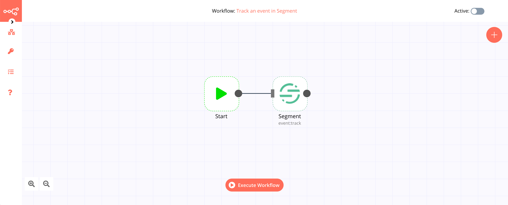

# Segment

[Segment](https://segment.com/) is a customer data platform (CDP) that helps you collect, clean, and control your customer data.

::: tip 🔑 Credentials
You can find authentication information for this node [here](../../../credentials/Segment/README.md).
:::

## Basic Operations

<Resource node="n8n-nodes-base.segment" />

## Example Usage

This workflow allows you to track an event in Segment. You can also find the [workflow](https://n8n.io/workflows/495) on the website. This example usage workflow would use the following two nodes.
- [Start](../../core-nodes/Start/README.md)
- [Segment]()

The final workflow should look like the following image.

### 1. Start node

The start node exists by default when you create a new workflow.

### 2. Segment node

1. First of all, you'll have to enter credentials for the Segment node. You can find out how to do that [here](../../../credentials/Segment/README.md).
2. Select the 'Track' option from the *Resource* dropdown list.
3. Enter the ID of the user in the *User ID* field.
4. Enter the name of event in the *Event* field.
5. Click on *Execute Node* to run the workflow.
