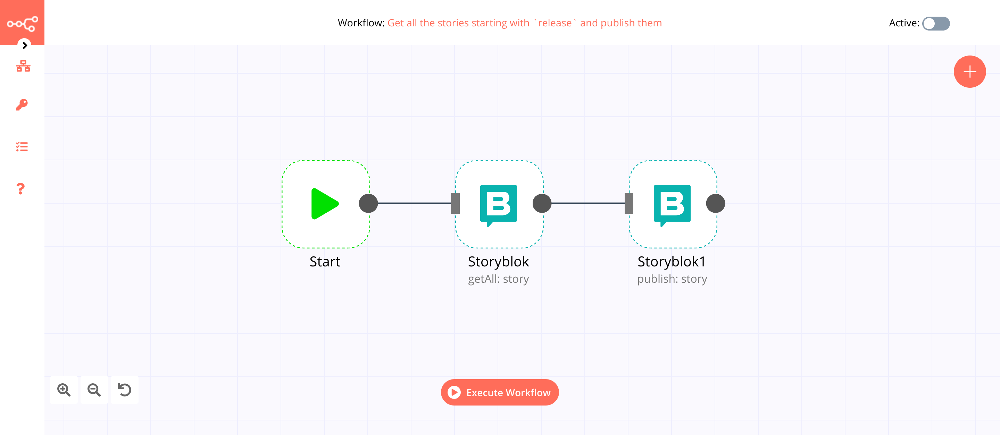
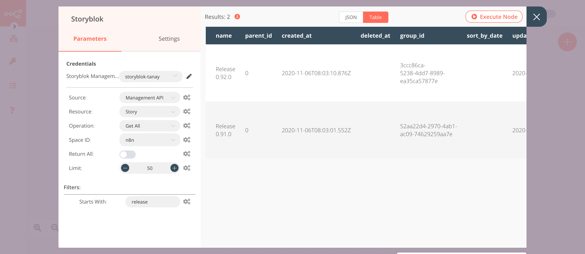
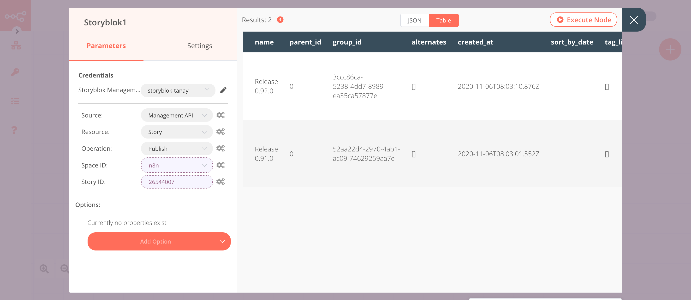

# Storyblok

[Storyblok](https://www.storyblok.com/) is a headless Content Management System with a visual composer.

::: tip 🔑 Credentials
You can find authentication information for this node [here](../../../credentials/Storyblok/README.md).
:::

## Basic Operations

### Content API
::: details Story
- Get a story
- Get all stories
:::

### Management API
::: details Story
- Delete a story
- Get a story
- Get all stories
- Publish a story
- Unpublish a story
:::

## Example Usage

This workflow allows you to create, update, and get an activity in Storyblok. You can also find the [workflow](https://n8n.io/workflows/744) on n8n.io. This example usage workflow would use the following nodes.
- [Start](../../core-nodes/Start/README.md)
- [Storyblok]()

The final workflow should look like the following image.

<!--  -->

### 1. Start node

The start node exists by default when you create a new workflow.

### 2. Storyblok node (create: activity)

This node will create an activity with the name `Morning Run` in Storyblok. To create an activity with a different name, you can enter the name of your activity instead.

1. First of all, you'll have to enter credentials for the Storyblok node. You can find out how to do that [here](../../../credentials/Storyblok/README.md).
2. Enter `Morning Run` in the ***Name*** field.
3. Enter `Run` in the ***Type*** field.
4. Select the date and time in the ***Start Date*** field.
5. Set ***Elapsed Time (Seconds)*** to `3600`.
6. Click on the ***Add Field*** button and select 'Distance' from the dropdown list.
7. Set ***Distance*** to `1000`. Storyblok measures distance in meters.
8. Click on ***Execute Node*** to run the node.

In the screenshot below, you will notice that the node creates an activity with the name `Morning Run` and type `Run`.

<!--  -->

::: v-pre
### 3. Storyblok1 node (update: activity)

This node will update the activity that we created in the previous node.

1. Select the credentials that you entered in the previous node.
2. Select 'Update' from the ***Operation*** dropdown list.
3. Click on the gears icon next to the ***Activity ID*** field and click on ***Add Expression***.
4. Select the following in the ***Variable Selector*** section: Nodes > Storyblok > Output Data > JSON > id. You can also add the following expression: `{{$node["Storyblok"].json["id"]}}`.
5. Click on the ***Add Field*** button and select 'Description' from the dropdown list.
6. Enter the description of the activity in the ***Description*** field.
7. Click on ***Execute Node*** to run the node.
:::

In the screenshot below, you will notice that the node adds a description to the activity that we created using the Storyblok node.

<!--  -->

::: v-pre
### 4. Storyblok2 node (get: activity)

This node returns the information of the activity that we created using the Storyblok node.

1. Select the credentials that you entered in the previous node.
2. Select 'Get' from the ***Operation*** dropdown list.
3. Click on the gears icon next to the ***Activity ID*** field and click on ***Add Expression***.
4. Select the following in the ***Variable Selector*** section: Nodes > Storyblok > Output Data > JSON > id. You can also add the following expression: `{{$node["Storyblok"].json["id"]}}`.
5. Click on ***Execute Node*** to run the node.
:::

In the screenshot below, you will notice that the node returns the information of the activity that we specified in this node.

<!--  -->
