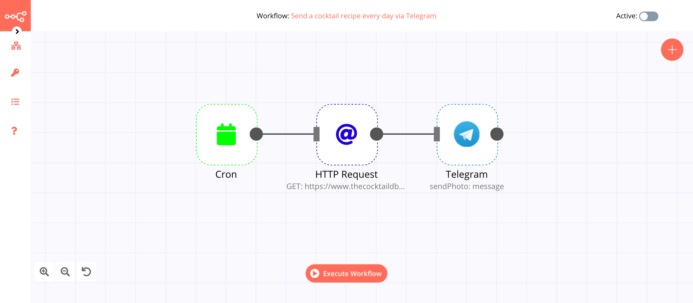

# Telegram

[Telegram](https://telegram.org) is a cloud-based instant messaging and voice-over-IP service.

::: tip 🔑 Credentials
You can find authentication information for this node [here](../../../credentials/Telegram/README.md).
:::

## Basic Operations

::: details Chat
- Get up to date information about a chat
- Leave a group, supergroup or channel
- Get the member of a chat
- Set the description of a chat
- Set the title of a chat
:::

::: details Callback
- Send an answer to a callback query sent from the inline keyboard
:::

::: details Message
- Edit a text message
- Send an audio file
- Send a chat action
- Send a document
- Send a text message
- Send a group of photos or videos to an album
- Send a photo
- Send a sticker
- Send a video
:::

## Example Usage

This workflow shows you how to send a message to a Telegram channel. You can also find the [workflow](https://n8n.io/workflows/451) on this website. This example usage workflow uses the following two nodes.
- [Start](../../core-nodes/Start/README.md)
- [Telegram]()

The final workflow should look like the following image.

### 1. Start node

The Start node exists by default when you create a new workflow.

### 2. Telegram node

1. First of all, you'll have to enter credentials for the Telegram node. You can find out how to do that [here](../../../credentials/Telegram/README.md). Use the bot access token.
2. Add your bot to the target channel. You can find instructions on how to add a bot to a Telegram channel in the FAQs below.
3. Enter the target channel ID in *Chat ID*. You can find instructions on how to find the Chat ID in the FAQs below.
4. Write the content of your message in the *Text* field.
5. Click on *Execute Node* to run the workflow.

## FAQs

### How can I send more than 30 messages per second?

The Telegram API has a [limitation](https://core.telegram.org/bots/faq#broadcasting-to-users) to send only 30 messages per second. However, you can do the following
- [Split In Batches]() node: Use the Split in Batches node to get at most 30 chat IDs.
- [Function]() node: Use the Function node to wait for a few seconds before sending a message to the next batch of chat IDs.

You can also use this [workflow](https://n8n.io/workflows/772).

### How do I add a bot to a Telegram channel?

1. In the Telegram app, access the target channel and tap on the channel name.
2. Make sure that the channel name is labeled as "public channel".
3. Tap on ***Administrators*** and then on ***Add Admin***.
4. Search for the username of the bot and select it.
5. Tap on the checkmark on the top-right corner to add the bot to the channel.

### How do I get a Chat ID?

There are two ways to get the Chat ID in Telegram. 

- Using the [Telegram Trigger]() node: On successful execution, the Telegram Trigger node returns a Chat ID. You can use the Telegram Trigger node in your workflow to get a Chat ID.
- Use the `@RawDataBot`: The `@RawDataBot` returns the raw data of the chat with a Chat ID. Invite the `@RawDataBot` to your channel/group, and upon joining, it will output a Chat ID along with other information. Be sure to remove the `@RawDataBot` from your group/channel afterward.

## Further Reading

- [Creating Telegram Bots with n8n, a No-Code Platform](https://medium.com/n8n-io/creating-telegram-bots-with-n8n-a-no-code-platform-fdf1f0928da7)
