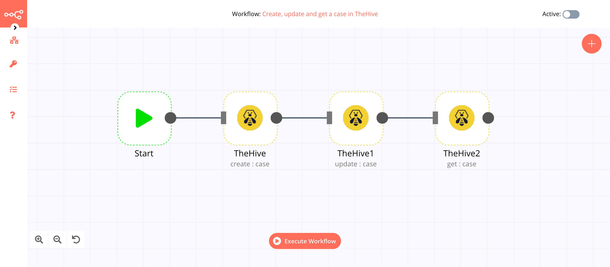

# TheHive

[TheHive](https://thehive-project.org/) is a scalable 4-in-1 open source and free security incident response platform designed to make life easier for SOCs, CSIRTs, CERTs and any information security practitioner. Thanks to Cortex, the powerful analysis engine It offers an easy way to investigate security incidents, plus you can actively respond to the threats and interact with other parties using Cortex responders.

::: tip 🔑 Credentials
You can find authentication information for this node [here](../../../credentials/TheHive/README.md).
:::

## Basic Operations

- Alert
    - List alerts
    - Fetch one alert
    - Create an alert
    - Update an alert
    - Search alerts
    - Count alerts (API v1 only)
    - Merge an alert into existing Case
    - Promote an alert into new Case
    - Execute a responder
- Observable
    - List observables
    - Fetch one observable
    - Create an observable
    - Update an observable
    - Search observables
    - Count observables (API v1 only)
    - Execute an analyzer
    - Execute a responder
- Case
    - List cases
    - Fetch one case
    - Create a case
    - Update a case
    - Search cases
    - Count cases (API v1 only)
    - Execute a responder
- Task
    - List task (specified Case)
    - Fetch one task
    - Create a task
    - Update a task
    - Search tasks
    - Count tasks (API v1 only)
    - Execute a responder
- Log
    - List logs
    - Fetch one log
    - Create a log
    - Execute a responder

## Example Usage

This workflow allows you to create a case in TheHive. You can also find the [workflow]() on the website. This example usage workflow would use the following two nodes.
- [Start](../../core-nodes/Start/README.md)
- [TheHive]()

The final workflow should look like the following image.

### 1. Start node

The start node exists by default when you create a new workflow.

### 2. TheHive node

1. First of all, you'll have to enter credentials for the TheHive node. You can find out how to do that [here](../../../credentials/TheHive/README.md).
2. Choose 'Case' in *Resource* field.
3. Choose 'Create' in *Operation* field
4. Enter case title in *Title* field. 
5. Enter case description in *Description* field.
6. Choose case severity in *Severity* field.
7. Choose case start date in *Start Date* field.
8. Enter case owner in *Owner* field
9. Toggle *Flag* field
10. Choose case TLP level in *TLP* field.
11. Enter case tags (separated by comma) in *Tags* field.
12. (Optional) Add any additional attributes, and provide their values. 
13. Click on *Execute Node* to run the workflow.
