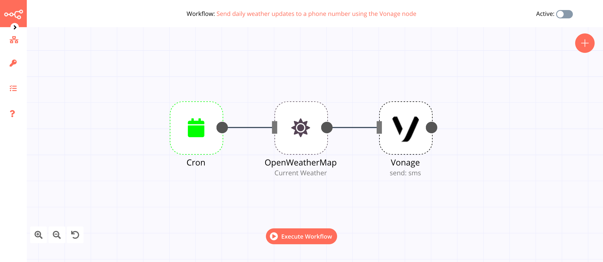
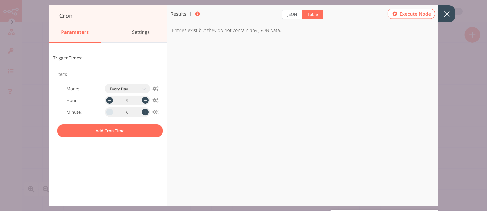
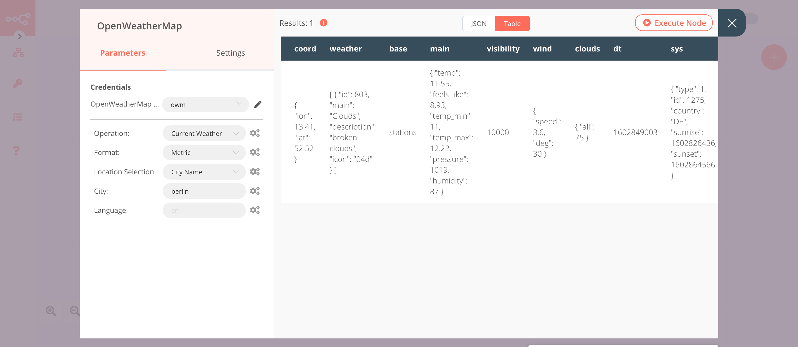
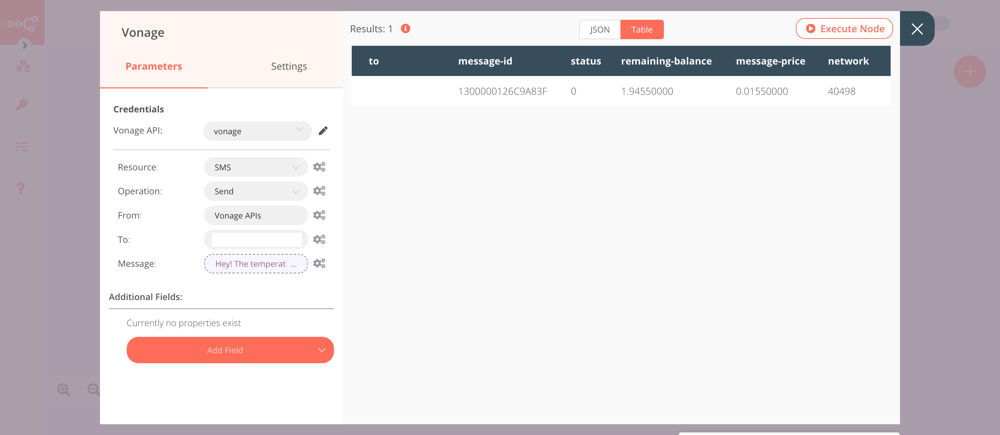

# Vonage

[Vonage](https://vonage.com/) provides unified communications, contact centers, and programmable communications APIs.

::: tip 🔑 Credentials
You can find authentication information for this node [here](../../../credentials/Vonage/README.md).
:::

## Basic Operations

::: details SMS
- Send
:::

## Example Usage

This workflow allows you to send daily weather updates via SMS to a phone number using the Vonage node. You can also find the [workflow](https://n8n.io/workflows/723) on n8n.io. This example usage workflow uses the following nodes.
- [Cron](../../core-nodes/Cron/README.md)
- [OpenWeatherMap](../../nodes/OpenWeatherMap/README.md)
- [Vonage]()

The final workflow should look like the following image.

### 1. Cron node

The Cron node will trigger the workflow daily at 9 am.

1. Click on ***Add Cron Time***.
2. Set hours to 9 in the ***Hour*** field.
3. Click on ***Execute Node*** to run the node.

### 2. OpenWeatherMap node (Current Weather)

This node will return the weather updates of `Berlin`. To get the weather updates of your city, enter the name of your city instead.

1. First of all, you'll have to enter credentials for the OpenWeatherMap node. You can find out how to do that [here](../../../credentials/OpenWeatherMap/README.md). 
2. Enter `berlin` in the ***City*** field.
3. Click on ***Execute Node*** to run the node.

In the screenshot below, you will notice that the node returns the weather updates of `Berlin`.

### 3. Vonage node (send: sms)

This node will send an SMS with the weather update received from the previous node to a phone number we specify.

1. First of all, you'll have to enter credentials for the Vonage node. You can find out how to do that [here](../../../credentials/Vonage/README.md).
2. Enter a Vonage phone number or brand name in the ***From*** field.
3. Enter the receiver's phone number in the ***To*** field.
4. Click on the gears icon next to the ***Message*** field and click on ***Add Expression***.
::: v-pre
5. Enter the following message in the ***Expression*** field `Hey! The temperature outside is {{$node["OpenWeatherMap"].json["main"]["temp"]}}℃.`.
6. Click on ***Execute Node*** to run the node.
:::

In the screenshot below, you will notice that the node sends an SMS to the phone number with the weather updates we received from the previous node.

