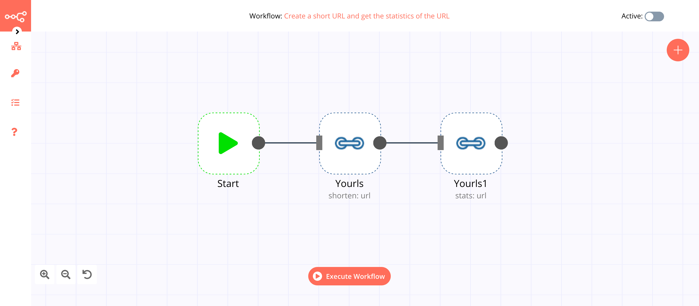
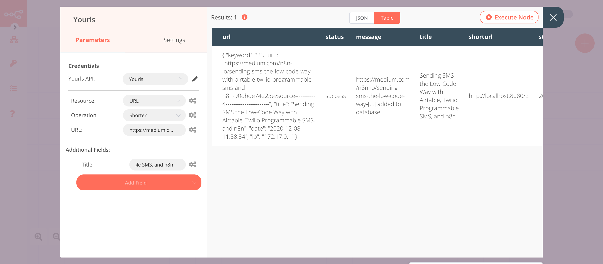
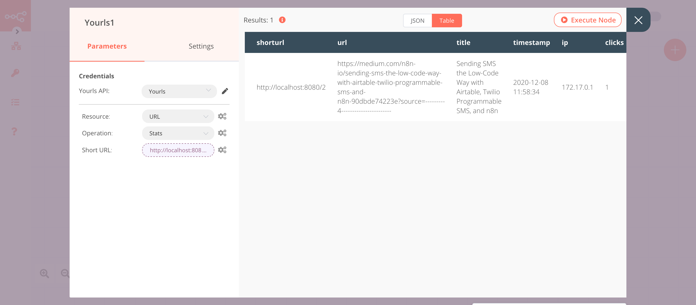

# Yourls

[Yourls](http://yourls.org/) is a free and open-source software that allows you to run your URL shortening service.

::: tip 🔑 Credentials
You can find authentication information for this node [here](../../../credentials/Yourls/README.md).
:::

## Basic Operations

::: details URL
- Expand a URL
- Shorten a URL
- Get stats about one short URL
:::

## Example Usage

This workflow allows you to create a short URL and get the statistics of the URL. You can also find the [workflow](https://n8n.io/workflows/815) on n8n.io. This example usage workflow uses the following nodes.
- [Start](../../core-nodes/Start/README.md)
- [Yourls]()

The final workflow should look like the following image.

### 1. Start node

The start node exists by default when you create a new workflow.

### 2. Yourls node (shorten: url)

This node will create  a short URL for the link we specify.

1. First of all, you'll have to enter credentials for the Yourls node. You can find out how to do that [here](../../../credentials/Yourls/README.md).
2. Enter the URL that you want to shorten in the ***URL*** field.
3. Click on ***Add Field*** and select 'Title'.
4. Enter a title in the ***Title*** field.
5. Click on ***Execute Node*** to run the node.

In the screenshot below, you will notice that the node creates a short URL for the URL you specified.

### 3. Yourls1 node (stats: url)

This node will give us the statistics of the short URL that we specify. We will get the statistics of the URL that we created in the previous step.
::: v-pre
1. Select the credentials that you entered in the previous node.
2. Select 'Stats' from the ***Operation*** dropdown list.
3. Click on the gears icon next to the ***Short URL*** field and click on ***Add Expression***.
4. Select the following in the ***Variable Selector*** section: Nodes > Yourls > Output Data > JSON > shorturl. You can also add the following expression: `{{$node["Yourls"].json["shorturl"]}}`.
5. Click on ***Execute Node*** to run the node.
:::
In the screenshot below, you will notice that the node gives us the statistics of the short URL that we created in the previous node.

