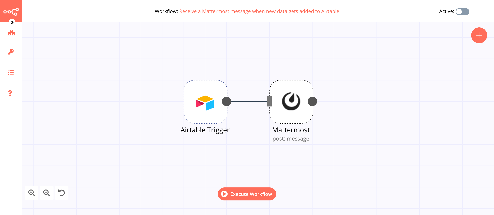
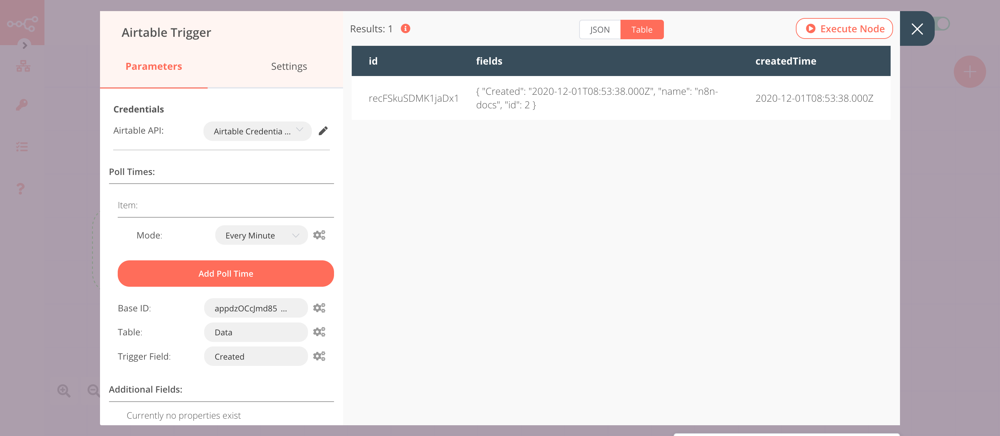
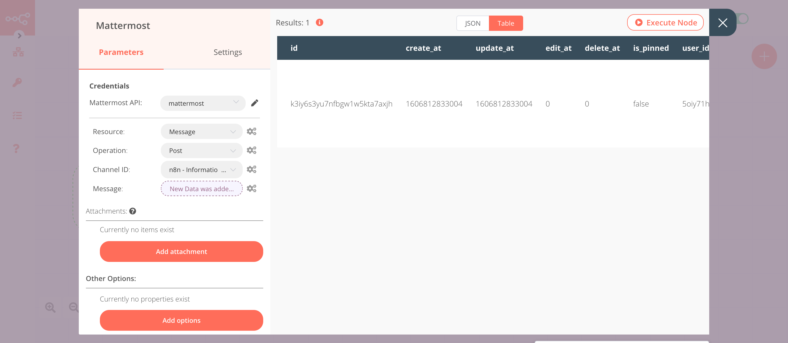

# Airtable Trigger

[Airtable](https://airtable.com/) is a spreadsheet-database hybrid, with the features of a database but applied to a spreadsheet. The fields in an Airtable table are similar to cells in a spreadsheet, but have types such as 'checkbox', 'phone number', and 'drop-down list', and can reference file attachments like images.

::: tip 🔑 Credentials
You can find authentication information for this node [here](../../../credentials/Airtable/README.md).
:::

## Example Usage

This workflow allows you to receive a Mattermost message when new data gets added to Airtable. You can also find the [workflow](https://n8n.io/workflows/799) on n8n.io. This example usage workflow would use the following nodes.
- [Airtable Trigger]()
- [Mattermost](../../nodes/Mattermost/README.md)

The final workflow should look like the following image.



### 1. Airtable Trigger node

The Airtable Trigger node will trigger the workflow when new data gets added to Airtable.

1. First of all, you'll have to enter credentials for the Airtable Trigger node. You can find out how to do that [here](../../../credentials/Airtable/README.md).
2. Click on ***Add Poll Time*** and select 'Every Minute' from the ***Mode*** dropdown list. This will check Airtable every minute for new data entries.
3. Enter the Base ID in the ***Base ID*** field. For obtaining the Base ID, head over to their [API page](https://airtable.com/api) and select the correct base. You’ll find the Base ID there.
4. Enter the table name in the ***Table*** field.
5. Enter a trigger field name in the ***Trigger Field*** field. If you don't have a 'Created Time' or 'Last modified time' field in your table, please create one.
6. Click on ***Execute Node*** to run the node.

In the screenshot below, you will notice that the node returns the new data from Airtable. This output gets passed on to the next node in the workflow.



### 2. Mattermost node (post: message)

This node will send a message of the new data in the channel `Information Updated` in Mattermost. If you have a different channel, use that instead.

1. First of all, you'll have to enter credentials for the Mattermost node. You can find out how to do that [here](../../../credentials/Mattermost/README.md).
::: v-pre
2. Select a channel from the ***Channel ID*** dropdown list.
3. Click on the gears icon next to the ***Message*** field and click on ***Add Expression***.
4. Enter the following message in the ***Expression*** field:
```
New Data was added to Airtable.
ID:{{$node["Airtable Trigger"].json["fields"]["id"]}}
Name: {{$node["Airtable Trigger"].json["fields"]["name"]}}
```
5. Click on ***Execute Node*** to run the node.
:::
In the screenshot below, you will notice that the node sends a message in Mattermost about the new data that got added to Airtable.


