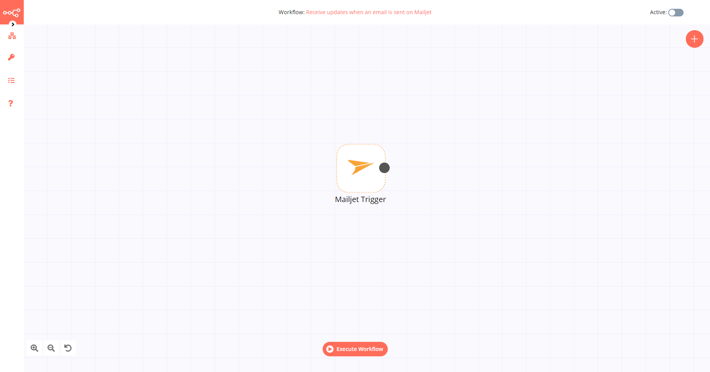

# Mailjet Trigger

[Mailjet](https://www.mailjet.com/) is a cloud-based email sending and tracking system. The platform allows professionals to send both marketing emails and transactional emails. It includes tools for designing emails, sending massive volumes and tracking these messages.

::: tip 🔑 Credentials
The instructions for authenticating with Mailjet are [here](../../../credentials/Mailjet/README.md).
:::

## Example Usage

This workflow allows you to receive updates when emails are sent in Mailjet. You can also find the [workflow](https://n8n.io/workflows/521) on the website. This example usage workflow would use the following node.
- [Mailjet Trigger]()

The final workflow should look like the following image.

### 1. Mailjet Trigger node

1. First of all, you'll have to add the webhook URL in Mailjet. You can find instructions on how to do that in the FAQs below.
2. Select the `email.sent` option in the *Event* field to receive updates when an email is sent.
3. Click on *Execute Node* to run the workflow.

## FAQs

### How do I add my webhook URL in Mailjet?
1. Open your Mailjet dashboard.
2. Click on your user icon in the top right.
3. Click on 'Account Settings'.
4. Under REST API, click on 'Event notifications (webhooks)'.
5. Paste your n8n webhook URL in the *Endpoint URL* field.
6. Select the events you plan on using by clicking on the appropriate checkboxes.
7. Click on the *Save* button.
