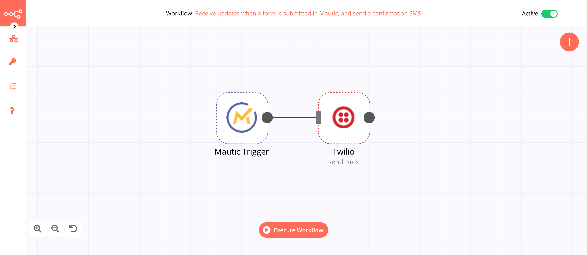
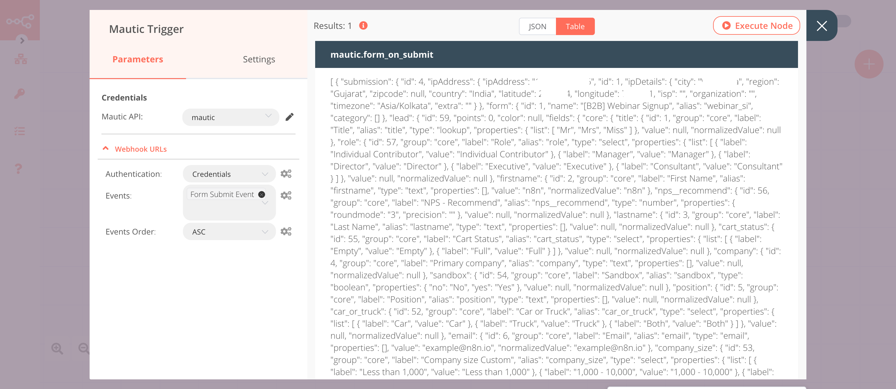
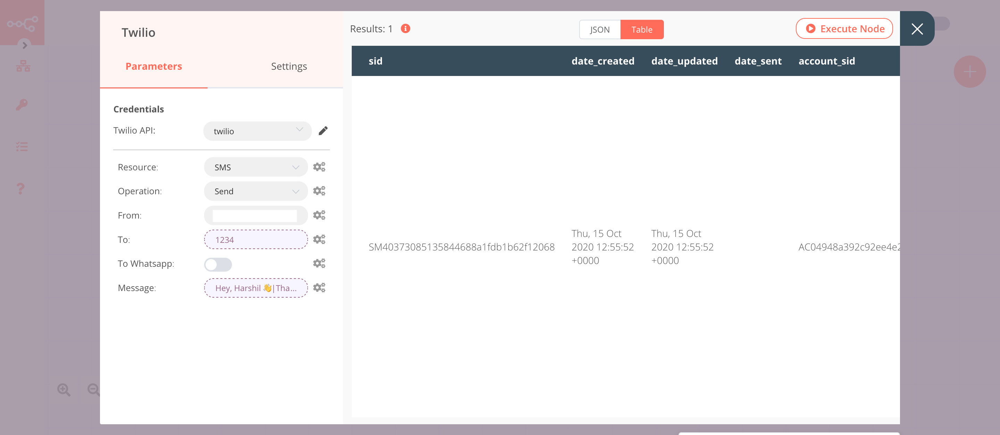

# Mautic Trigger

[Mautic](https://www.mautic.org/) is an open-source marketing automation software that helps online businesses automate their repetitive marketing tasks such as lead generation, contact scoring, contact segmentation, and marketing campaigns.

::: tip 🔑 Credentials
You can find authentication information for this node [here](../../../credentials/Mautic/README.md).
:::

## Events

- Contact Channel Subscription Change Event
- Contact Deleted Event
- Contact Identified Event
- Contact Points Changed Event
- Contact Updated Event
- Email Open Event
- Email Send Event
- Form Submit Event
- Page Hit Event
- Text Send Event

## Example Usage

This workflow allows you to receive updates when a form is submitted in Mautic using the Mautic Trigger node and send a confirmation SMS to the user. You can also find the [workflow](https://n8n.io/workflows/721) on n8n.io. This example usage workflow would use the following node.
- [Mautic Trigger]()
- [Twilio](../../nodes/Twilio/README.md)

The final workflow should look like the following image.



### 1. Mautic Trigger node

The Mautic Trigger node will trigger the workflow when a form is submitted.

1. First of all, you'll have to enter credentials for the Mautic Trigger node. You can find out how to do that [here](../../../credentials/Mautic/README.md).
2. Select 'Form Submit Event' from the ***Events*** dropdown list.
3. Click on ***Execute Node*** to run the node.

In the screenshot below, you will notice that the node returns the data submitted to a Mautic form. This output is passed on to the next node in the workflow.



### 2. Twilio node (send: sms)

This node sends a registration confirmation SMS to the users who filled out the Mautic form. We get the phone number of the user from the previous node.

1. First of all, you'll have to enter credentials for the Twilio node. You can find out how to do that [here](../../../credentials/Twilio/README.md).
::: v-pre
3. Enter the Twilio phone number in the ***From*** field.
4. Click on the gears icon next to the ***To*** field and click on ***Add Expression***.
5. Select the following in the ***Variable Selector*** section: Nodes > Mautic Trigger > Output Data > JSON > mautic.form_on_submit > [item: 0] > submission > results > phone_number. You can also add the following expression: `{{$node["Mautic Trigger"].json["mautic.form_on_submit"][0]["submission"]["results"]["phone_number"]}}`.
6. Click on the gears icon next to the ***Message*** field and click on ***Add Expression***.
7. Enter the following message in the ***Expression*** field.
```
Hey, {{$node["Mautic Trigger"].json["mautic.form_on_submit"][0]["submission"]["results"]["first_name"]}} 👋
Thank you for signing up for the Webinar - Getting Started with n8n. The webinar will start at 1800 CEST on 31st October 2020.
See you there!
``` 
8. Click on ***Execute Node*** to run the node.
:::

In the screenshot below, you will notice that the node sends an SMS to the user whose name and the phone number is returned by the Mautic Trigger node.


