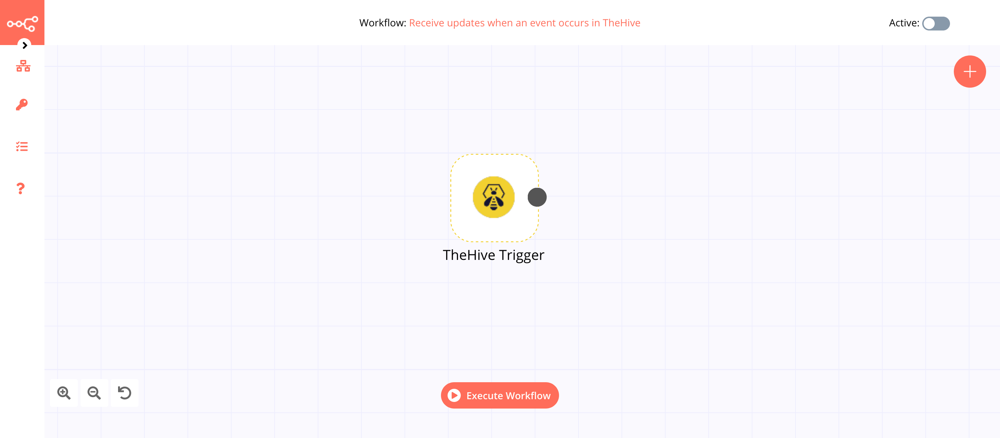

# TheHive Trigger

[TheHive](https://thehive-project.org/) is a scalable 4-in-1 open source and free security incident response platform designed to make life easier for SOCs, CSIRTs, CERTs and any information security practitioners

::: tip 🔑 Credentials
You can find authentication information for this node [here](../../../credentials/TheHive/README.md).
:::


## Example Usage

This workflow allows you to receive event from a TheHive instance via TheHive Trigger node. You can also find the [workflow]() on the website. This example usage workflow would use the following node.
- [TheHive Trigger]()

The final workflow should look like the following image.




### 1. TheHive Trigger node

1. First of all, you'll have to add the webhook URL into TheHive instance configuration.
2. Select the *events* that you are interested in.
3. Click on *Execute Node* to run the workflow.


###  Webhook configuration [docs](https://github.com/TheHive-Project/TheHiveDocs/blob/master/TheHive4/Administration/Webhook.md)

To configure the webhook into TheHive instance you need   
1. Copy the webhook URL from TheHive-Trigger node
2. Add configuration lines to application.conf (TheHive configuration file)
    ```
    notification.webhook.endpoints = [
        {
            name: WEBHOOK_NAME
            url: WEBHOOK_URL
            version: 0
            wsConfig: {}
            includedTheHiveOrganisations: ["ORGANIZATION_NAME"]
            excludedTheHiveOrganisations: []
        }
    ]
    ```
3. Enable notifications using this curl command
    ```

    curl -XPUT -uTHEHIVE_USERNAME:THEHIVE_PASSWORD -H 'Content-type: application/json' THEHIVE_URL/api/config/organisation/notification -d '
    {
        "value": [
            {
            "delegate": false,
            "trigger": { "name": "AnyEvent"},
            "notifier": { "name": "webhook", "endpoint": "WEBHOOK_NAME" }
            }
        ]
    }'
    ```
